# Ford Fusion — Need for Speed Underground 2

> **Release v1.5 (06/10/2026):** carrocerias lisas nos dois carros, aprovadas no jogo. A pintura usa as normais do LOD A do MW, com faces orientadas por elas, e a frente foi suavizada. No 2012, a tampa e o para-choque traseiro passam a vir do LOD A, e a pintura plana passa a ser decimada a partir dele. A lente da lanterna do 2012 tem uma só camada, sem manchas. Os refletores inferiores do 2018 recebem o acabamento do 2012. [Carroceria lisa](docs/CARROCERIA-2012-v12.md) · [v12.2](docs/CARROCERIA-v12.2.md).

> **Release v1.4 (07/10/2026):** luzes do 2012 aprovadas no jogo. Faróis, faróis de milha e lanternas não apareciam porque o UG2 só vincula as texturas de carro cujos nomes ele mesmo monta (`%s_MISC`, `%s_SIDELIGHT`, `%s_CENTRE_BRAKELIGHT`, `<lâmpada>_GLASS_OFF`...). As folhas das lâmpadas foram renomeadas para esses nomes. Os refletores do 2012 ficaram com uma única camada e normal plana. O farol de milha do 2018 agora é desenhado como o farol principal. As texturas vinculadas foram reduzidas, porque a memória dos carros está no limite: com o 2012 v11, o 2018 fechava o jogo. [Luzes do 2012](docs/LUZES-2012-v11.md) · [refletores](docs/REFLETORES-2012.md) · [farol de milha do 2018](docs/fog-2018-v11.2/).

> **Release v1.3 (06/10/2026):** Fusion 2018 aprovado no jogo com friso em gradiente metálico e lentes brancas claras, mantendo o formato da v1.2 e a pintura da tampa em 6.000 faces. Dois ZIPs com instaladores; arquivos do 2012 preservados. [Referências, prévias e validação](docs/FRISO-v10.16.md).

> **Atualização v10.9 (06/10/2026):** aprovado pelo usuário o 2018 com lentes opacas sem faces opostas coincidentes e o **friso original do MW em branco**, anexado à tampa. v10.7/v10.8 exibiram as lanternas, mas escuras. O texto da tela inicial foi corrigido na entrada de copyright do idioma. Validação dos arquivos passou; a aparência no jogo foi aprovada pelo usuário. [Registro e novas prévias](docs/REPARO-LANTERNAS-2018.md).

Dois ports, a partir dos ZIPs do Most Wanted 2005. Os arquivos de lá não são alterados. A estrutura que o Underground 2 aceita foi medida no **Escort RS**.

| Most Wanted | Underground 2 | Carro |
| --- | --- | --- |
| `MUSTANGGT` | `MUSTANGGT` | Fusion Titanium 2018 AWD |
| `COBALTSS` | `FOCUS` | Fusion Titanium 2012 FWD |

O Fusion Titanium 2012 reaproveita o caminho do 2018 (corte, vidros, adesivos, vinil, chassi). O que muda é o slot e a tração, dianteira no 2012. O método está em [docs/PORTAR-PARA-NFSU2.md](docs/PORTAR-PARA-NFSU2.md).

> **Estado:** em 06/10/2026 os dois carros foram reexportados da release **v2.7** do Most Wanted e instalados para teste (v10): o Fusion Titanium 2018 AWD em `CARS/MUSTANGGT`, no lugar do Ford Mustang GT, e o Fusion Titanium 2012 FWD em `CARS/FOCUS`, no lugar do Ford Focus. A v9 do 2018, aprovada no jogo em 27/09/2026 no slot do Focus, é a das capturas abaixo. O histórico está em [TODO.md](TODO.md).

A v1.5 deixa as duas carrocerias lisas e uniformes. A v1.4 acrescentou as luzes do 2012 e o farol de milha do 2018. Da v1.3 vêm as pontas do friso limitadas antes da lateral da lente e recupera seu gradiente metálico, com branco claro separado nas lentes. As normais das superfícies foram recuperadas para evitar o aspecto plano. O usuário aprovou o resultado no jogo: “perfeito”.

## Downloads — v1.5

Uma tag e uma release para os dois veículos, como no projeto MW2005. As versões públicas usam `vX.X`; os números v10.x abaixo registram as etapas internas do diagnóstico. Releases e tags anteriores foram removidas; o histórico do git as mantém.

| Pacote | Substitui | Estado |
| --- | --- | --- |
| [Fusion 2018 AWD](https://github.com/nillander/Ford-Fusion-Titanium-NFSU2/releases/download/v1.5/Fusion2018_AWD_NFSU2.zip) | Mustang GT (`MUSTANGGT`) | v12.2 aprovada no jogo: carroceria lisa, farol de milha como o farol principal, refletores corrigidos |
| [Fusion 2012 FWD](https://github.com/nillander/Ford-Fusion-Titanium-NFSU2/releases/download/v1.5/Fusion2012_FWD_NFSU2.zip) | Focus (`FOCUS`) | v12.2 aprovada no jogo: luzes completas, carroceria lisa, traseira em LOD A |

[Release e hashes dos arquivos](https://github.com/nillander/Ford-Fusion-Titanium-NFSU2/releases/tag/v1.5). Cada ZIP inclui seu instalador, patch PowerShell, instruções e manifesto SHA-256.

## No jogo

### Reparo das lanternas do 2018

O **friso existe no Fusion 2018 do MW**. Sua remoção no 2012 não se aplica a este port. A v10.8 acrescentou uma faixa sobre a pintura sem retirar o friso original escuro da BASE; a v10.9 recupera a peça original do LOD A (100 triângulos), troca sua cor por branco opaco e a coloca em TRUNK. As quatro lentes mantêm contorno vermelho e fundo branco; os refletores inferiores usam o mesmo vermelho claro.

| Construção: lentes de origem | Construção: contornos e fundos sólidos |
| --- | --- |
|  |  |

| v10.8 no jogo: ainda escuro | v10.9: prévia do pacote compilado |
| --- | --- |
|  |  |


As prévias novas respeitam o descarte de faces de costas e não viram as normais para a câmera. Elas verificam a malha e as cores do pacote, mas não reproduzem a iluminação/shader do jogo. O usuário aprovou a base v10.9 no jogo. A v1.3 e os BIN atuais consolidam a v10.16, aprovada no jogo pelo usuário.

### Friso metálico e lentes brancas claras — v1.3

O friso da tampa e suas continuações nas lanternas usam um gradiente vertical cinza/branco com efeito metálico. As lentes mantêm um branco claro em sua própria célula de textura. As normais de origem voltam a permitir a iluminação característica das duas superfícies; elas deixam de compartilhar a orientação constante que dava à v1.2 uma aparência plana e escura.

O formato da v1.2 foi preservado: pontas, posições de vértices, índices, grupos e materiais permanecem iguais. O ajuste não aumentou os BIN nem os buffers das texturas. A pintura da tampa continua em 6.000 faces.

| v1.2 no jogo: acabamento plano | Referência de acabamento indicada pelo usuário |
| --- | --- |
| 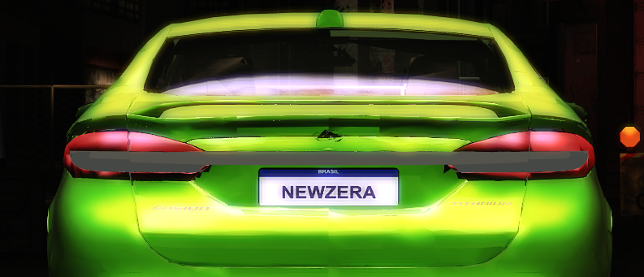 | 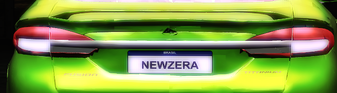 |

| Prévia traseira da v1.3 compilada | Prévia em ângulo da v1.3 compilada |
| --- | --- |
| 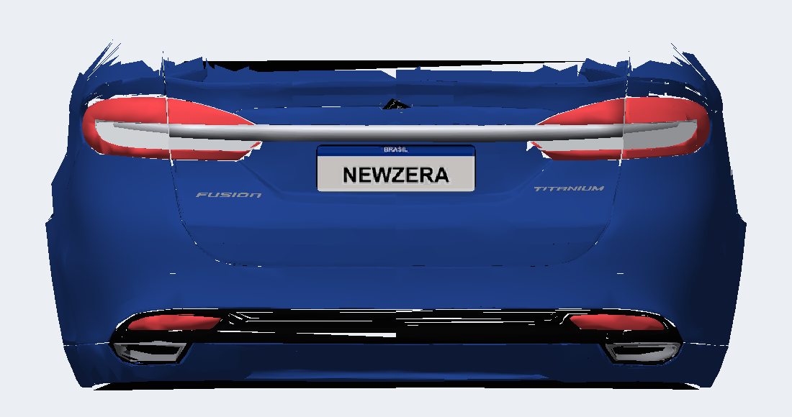 | 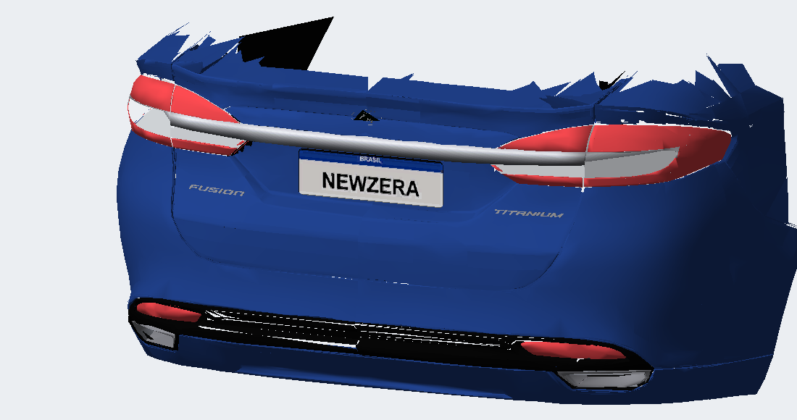 |

O usuário aprovou o resultado: “perfeito”. O gradiente está pintado na célula MISC existente e usa DULLPLASTIC, sem depender de um novo shader cromado. As prévias verificam o pacote compilado, mas não reproduzem a iluminação do jogo. [Construção, hashes e aprendizados](docs/FRISO-v10.16.md).

### Histórico: primeira extensão do friso (v10.10)

O friso original termina na emenda da tampa. Foram acrescentadas duas continuações brancas na BASE, sobre as lentes externas da carroceria, acompanhando a superfície curva. Nas lentes internas, dois pequenos painéis planos deixam mais branca a área abaixo do friso sem alterar toda a borda vermelha. O trecho central e os painéis internos pertencem a TRUNK.

| Estado anterior no jogo | Referência real |
| --- | --- |
| 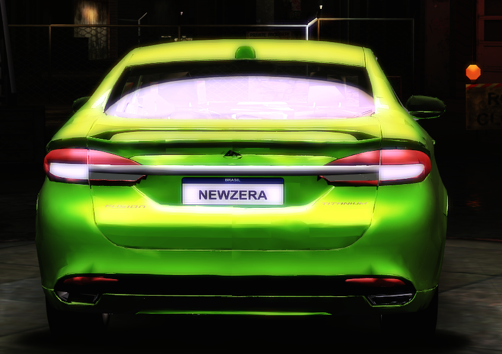 | 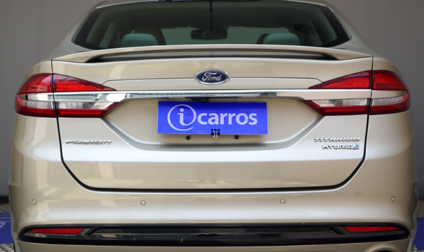 |

| Friso esperado, marcado pelo usuário | Área inferior branca, marcada pelo usuário |
| --- | --- |
| 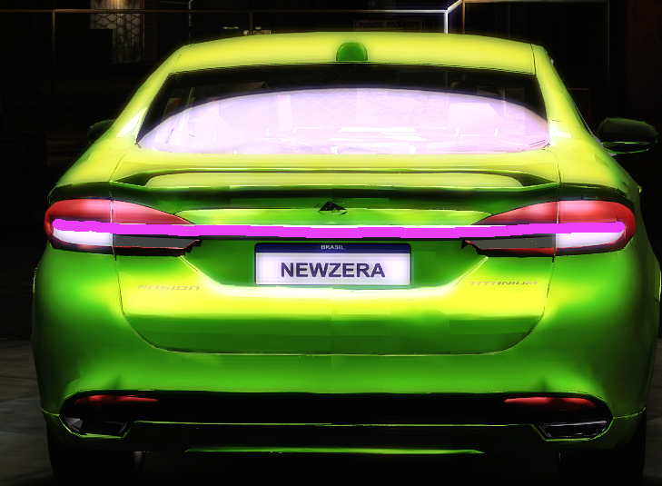 | 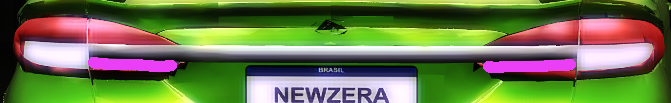 |

| Nova prévia traseira | Nova prévia em ângulo |
| --- | --- |
| 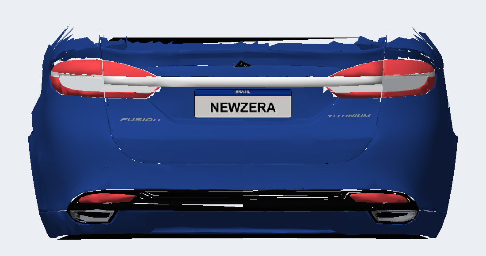 | 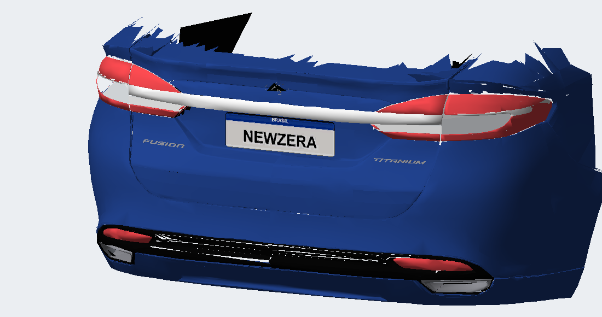 |

Estas prévias registram a tentativa v10.10; o resultado atual aprovado aparece acima.

### Capturas da v9 aprovada no slot Focus

| Garagem | Cidade |
| --- | --- |
|  |  |
|  |  |


## O que entra no jogo

| Arquivo | Conteúdo |
| --- | --- |
| `CARS/MUSTANGGT/GEOMETRY.BIN` | Fusion 2018: `KIT00_BODY_A`, `KITW01–04_BODY_A`, `KIT00_TRUNK_A`, `BASE_A`, `KIT00_FRONT_WHEEL_A` e os adesivos |
| `CARS/MUSTANGGT/TEXTURES.BIN` | v11.3: 13 texturas RAWW; folhas de lâmpada com nomes vinculados (`SIDELIGHT`, `KIT00_HEADLIGHT_GLASS_OFF`); cores opacas das lanternas, refletores e friso em células livres de MISC/DXT1; lentes dos faróis, sombras e neon em DXT3 |
| `CARS/FOCUS/GEOMETRY.BIN` | Fusion 2012: as mesmas peças, com prefixo `FOCUS_` |
| `CARS/FOCUS/TEXTURES.BIN` | v11.1: 14 texturas RAWW. Lâmpadas em `FOCUS_SIDELIGHT`, lente do farol em `FOCUS_KIT00_HEADLIGHT_GLASS_OFF` (128 px), lente da lanterna em `FOCUS_CENTRE_BRAKELIGHT` (128 px) |
| `GLOBAL/GlobalB.lzc` | registros `MUSTANGGT` e `FOCUS` alterados (rodas, massa, inércia, motor, câmbio, tração, chassi). Editado no próprio arquivo do jogo |

`VINYLS.BIN` e `PARTS_ANIMATIONS.bin` continuam os do jogo.

### Peças

Contagens abaixo: arquivos do 2018 incluídos na release v1.5 (v12.2).

| Peça UG2 | Origem (MW z10) | Triângulos |
| --- | --- | --- |
| `KIT00_BODY_A` e `KITW01–04` | pintura LOD B nas áreas planas + LOD A no bico, na frente do teto e no para-choque traseiro. As cinco carrocerias são a mesma malha | 20.582 |
| `KIT00_TRUNK_A` | tampa LOD A com pintura reduzida para 6.000 triângulos, lentes internas, friso original branco e refletores | 7.473 |
| `BASE_A` | base, capô LOD B, bico/teto LOD A, vidros, luzes externas, faróis de milha (LOD B), interior e motorista | 21.263 |
| `KIT00_FRONT_WHEEL_A` | roda de 20 raios, aro 18" (LOD B) | 8.614 |

O 2012 tem faróis e lanternas nos dois lados e cerca de 2,5 vezes mais triângulos neles e na traseira, em todos os LODs. Para caber, a distribuição muda (valores em `scripts/ports.py`, explicados em [docs/PORTAR-PARA-NFSU2.md](docs/PORTAR-PARA-NFSU2.md)):

| Peça UG2 (2012) | Conteúdo | Triângulos |
| --- | --- | --- |
| `KIT00_BODY_A` e `KITW01–04` | pintura plana decimada do LOD A, bico e frente do teto em LOD A, faróis LOD D com lente LOD C | 20.957 |
| `KIT00_TRUNK_A` | tampa e para-choque traseiro LOD A decimados para 14.800, lanternas LOD D com lente de uma camada e os refletores | 20.122 |
| `BASE_A` | base, peças pintadas da base, capô, vidros, interior e motorista | 21.299 |
| `KIT00_FRONT_WHEEL_A` | a mesma roda do 2018 | 8.614 |

Cada peça fica em até 21.500 triângulos (64.500 índices). A v1, com até 62.886 índices concentrados, fechou o jogo.

### A malha nas imagens

Azul é `KIT00_BODY_A`. Cinza é `BASE_A`: capô, frente do teto, vidros, faróis e lanternas. Laranja é `KIT00_TRUNK_A`. A roda preta está nos quatro arcos medidos na malha. Os quatro `KITW` repetem a malha azul e ficam de fora deste render. A imagem sai do `GEOMETRY.BIN` instalado.


A v9 inteira, nas seis vistas de `scripts/preview.py`. Magenta é face de costas ou a lente; o para-lama por dentro sai verde.


| Uma lâmina de vidro por janela | Pintura no molde de vinil do Focus |
| --- | --- |
|  |  |

| As cinco carrocerias são a mesma malha | v8: pintura em peças que o slot não desenha |
| --- | --- |
|  |  |

### Da v3 à v5

A v3 decimou a pintura. Magenta é face de costas ou buraco: o capô, o teto e a coluna ficaram partidos.


A v4 fechou essa lataria e devolveu o vidro traseiro que vinha do Most Wanted. As faixas douradas são o `REAR_WINDOW` de origem. A v5 substituiu o vidro decimado por uma lâmina nova em cada janela.

| Vidro traseiro do MW, com a faixa que faltava | As lâminas da v5, sem a carroceria |
| --- | --- |
|  |  |

Na v4 o para-lama por dentro já sai verde e o miolo da lataria deixa de ser mancha magenta.


### Bico, tampa, adesivos e molde

| Rebaixo do emblema, preenchido na pintura | Tampa e lanternas da malha aprovada |
| --- | --- |
|  |  |

| Molde de vinil do Focus, antes de projetar a pintura | Lanternas lidas do Most Wanted |
| --- | --- |
|  |  |

As faixas coloridas são as peças `DECAL`, não a pintura. Elas sentam no para-brisa, no capô e nas portas. No centro do para-brisa a v6 ainda mostra a emenda das duas lâminas.

| Adesivos de teste na v6 | Emenda do para-brisa |
| --- | --- |
|  |  |

## Aprendizados aplicados (do MW2005 e deste port)

1. **Limite de índices por peça e orçamento de carregamento.** O escritor usa índices de 16 bits e limita cada peça a 65.535 índices
   (~21.800 triângulos). Isso não garante que o conjunto abra: o teste D fechou mesmo abaixo das contagens agregadas de 65.535. O LOD A do Fusion tem ~190 mil triângulos, e o slot FOCUS só desenha
   carroceria, base, porta-malas, roda e adesivos. A pintura foi repartida nessas peças
   (≤ 21.500 triângulos), sem truncar a malha:
   - áreas planas ficam no LOD B; o bico, a frente do teto e o para-choque traseiro usam o LOD A,
     com corte exato (`scripts/clip.py`). Decimar o LOD B por QEM deformava o encontro para-lama/porta;
   - os vidros são uma lâmina nova por janela (`scripts/newglass.py`); o interior foi reduzido para
     caber o LOD A na base. A mancha magenta da v3 e o fechamento na v4 estão na seção anterior.
2. **DXT1 para peças opacas.** DXT3 desliga a gravação de profundidade (lição da grade do MW).
   MISC, LOGO, INTERIOR, BADGING, roda, pneu, motorista e as carcaças dos faróis/lanternas são DXT1.
   As lentes usam uma cópia DXT3 separada da mesma folha e ficam por último na ordem de desenho.
3. **Kits não podem sumir com o carro.** As 4 carrocerias `KITW` existem (carros da IA aplicam
   kits aleatórios).
4. **Rodas pela geometria, não por chute.** Os arcos dos para-lamas foram medidos na malha:
   dianteira X = +1,431, traseira X = −1,311 (entre-eixos 2,74 m), Y = ±0,78, Z = 0,13,
   raio 0,3225 (235/40 R18), largura 0,235. O port anterior gravava 3,3 m de entre-eixos.
5. **Marcadores** (faróis, lanternas, brake light central, escapamentos, aerofólio, entrada de ar do
   teto) vêm das posições aprovadas no MW; no UG2 o lado esquerdo é +Y.
6. **Lente pela peça, não pelo material (v10).** Na v2.7 do MW a lente das lanternas do 2018 passou a usar um
   shader difuso. O build agora reconhece a lente pelo nome `*_GLASS_*`; dentro dela, o grupo com material
   `BRAKELIGHT` é o refletor opaco do 2012 (lição 17 do MW) e continua opaco.
7. **Folha da lanterna pela UV.** O 2012 desenha as carcaças das lanternas na folha do farol e as duas lentes
   na folha da lanterna. Cada lente é uma cópia DXT3 da folha que a UV dela usa; só a da lanterna recebe o
   vermelho forte.
8. **Tração dianteira é 0,0.** No `GlobalB` o valor em 720 é a parte que vai para o eixo traseiro: os FWD do
   jogo gravam 0,0 e os RWD 1,0. O `ports.py` tinha 1,0 para o 2012, o que o deixaria com tração traseira.
9. **Pacote de texturas com identidade própria (v10.1).** O cabeçalho `0x33310001` herdado do MW tinha nome
   vazio e hash `FFFFFFFF`. Com um carro só assim (v9 no Focus) o jogo carregou; com o Focus e o Mustang assim,
   faltaram texturas nos dois (no 2018 só sobraram capô e para-brisa, que usam textura global). Agora cada pacote
   leva o nome, o caminho e o hash que os carros originais usam: `CARTEXTURES`,
   `Global\Pipeline\CarTemplateTextures_<SLOT>.tpk` e o hash desse caminho.
10. **Faces repetidas fora (v10.2).** As cascas do MW repetem cada face no mesmo lugar, virada ao contrário (lição
    da v2.6/v2.8 do MW: o capô). Com os mods que desenham as duas faces, a cópia escura briga com a visível. O build
    tira essa cópia também da base, das carcaças das luzes e do interior (no interior fica a face voltada para a
    cabine), e o orçamento que sobra vai para o interior.
11. **Farol do 2012.** O MW ilumina o fundo preto do farol com o shader de lâmpada; no UG2 ele fica preto e o farol
    parece um buraco. A cópia UG2 da folha do farol troca essa célula preta por uma cópia escurecida da célula cromada.
12. **Lista de peças do Mustang (v10.4).** No banco de peças do `GlobalB` (chunk `0x80034602`) cada peça aponta
    para uma tabela de modelo: `<CARRO>` + `_KIT00` + `_BODY` + `_<LOD>`. As tabelas do `MUSTANGGT` tinham sido
    reescritas pelo mod de Mustang personalizado com a entrada do LOD A vazia: o jogo procurava
    `MUSTANGGT_KIT00_A` em vez de `MUSTANGGT_KIT00_BODY_A`, e o mesmo na roda e no porta-malas. Só a base, cuja
    entrada vazia é a original, aparecia. `scripts/globalb_parts.py` aponta cada peça do Mustang para a tabela do
    seu par no Focus (o layout do Escort em que a v9 foi aprovada). Nada mais do registro muda.
13. **Rodas fixadas nos dois slots.** O registro do Mustang chega com Z 0,17 e raio 0,343. O patch grava X, Y,
   Z, raio e largura aprovados na v9, em vez de herdar os do slot.
14. **A malha visível depende do grupo e da textura carregados.** SOLID_LAMPS e KIT00_BRAKELIGHT não apareceram nos testes v10.5/v10.6. MISC + DULLPLASTIC apareceu na v10.7. Isso confirma o caminho que funcionou neste carro, sem provar uma proibição geral de nomes personalizados. As células novas ficam fora das UVs originais e alinhadas aos blocos DXT1.
15. **Mais vermelho na textura não resolve toda superfície escura.** v10.8 clareou a textura, mas o jogo continuou escuro. A v10.9 remove faces opacas coincidentes com normais opostas e conserva a face exterior das lentes/refletores. O usuário aprovou o resultado visual da v10.9. Como o friso também foi corrigido, essa aprovação não isola a contribuição de cada mudança.
16. **Prévia pode esconder normais incorretas.** O render antigo vira as normais para a câmera. `scripts/preview_tail.py` usa `cull=True` e `flip_normals=False`, lendo os BIN compilados. Uma prévia clara ainda não demonstra que o shader do jogo exibirá a mesma cor.
17. **Friso do 2018: recuperar a peça certa.** Ele está em BASE/MISC do MW, separado da pintura. A peça original escura permaneceu na frente da faixa criada na v10.8. Na v10.9 ela sai da BASE e entra em TRUNK com textura branca, mantendo sua forma original. A remoção do friso no 2012 é uma alteração específica daquele modelo.
18. **Texto da tela inicial e créditos são arquivos distintos.** `CREDITS/NA_ENGLISH.TXT` controla a lista de créditos. A mensagem inicial é a chave `181419E5` de `LANGUAGES/English.bin`. `scripts/restore_startup_copyright.py` restaura somente essa entrada como “© 2004 Electronic Arts Inc. Todos os direitos reservados.”, preservando as outras strings e os offsets.

19. **Friso externo acompanha a carroceria.** O friso original de BASE_A cobre somente a tampa. As continuações externas ficam em BASE e são recortadas na emenda Y ±0,585, preservando a separação da tampa. A camada deve seguir a lente vermelha e o fundo branco: uma folha só no fundo pode ficar escondida pela curvatura da lente.
20. **Branco inferior precisa de superfície e normal coerentes.** Um fundo triangulado em leque pode não ser plano e conter faces voltadas para baixo. Os pequenos painéis abaixo do friso nas lentes internas usam um plano frontal e faces orientadas para fora. A cor branca na textura, sozinha, não corrige um painel encoberto ou sombreado incorretamente.
21. **Instalador seletivo e verificável.** `release/globalb_patch.ps1` aceita GlobalB JDLZ, aplica a tração correta por veículo e copia somente ids 5/6/10/28 no Mustang. Seus resultados foram comparados byte a byte com os scripts Python. Não distribuir o banco completo desta instalação e não copiar as 270 peças: essa combinação fechou o jogo.
22. **Uma release, dois pacotes.** `scripts/package_release.py` aceita versões `vX.X`, gera ZIPs separados por veículo e inclui hashes de conteúdo. O manifesto identifica exatamente os BIN publicados, sem confundir prévias e aprovação no jogo.
23. **Nomes de textura que o jogo vincula.** O `CarRenderInfo` só procura, no TEXTURES.BIN do carro, nomes que ele próprio monta (`%s_MISC`, `%s_SIDELIGHT`, `%s_DOOR_HANDLE`, `%s_CENTRE_BRAKELIGHT`, `%s_INTERIOR`, `%s_LOGO`, `%s_BADGING`, `%s_RIM`, `%s_TIRE`...). Também usa o `TEXTURE_NAME` das lâmpadas no GlobalB + `_GLASS_OFF`/`_OFF`/`_GLASS_LEFT`... Qualquer outro nome é ignorado, e os grupos que o usam não são desenhados. `tex_alias` em `ports.py` renomeia as folhas. Texturas vinculadas ficam residentes: a memória dos carros é curta, por isso `tex_size` reduz lentes e emblemas.

## Performance (`scripts/globalb_patch.py`)

- **Motor e câmbio do Toyota Corolla levados a 248 cv** (o 2.0 EcoBoost do Fusion Titanium 2018): todas as
  curvas de torque (estoque, turbo e upgrades) ×2,212; giro e relações do Corolla. Pela curva: 248 cv
  (245 hp) a 6.560 rpm e 288 Nm (Corolla ~111 hp / 130 Nm; Focus original ~125 hp / 182 Nm).
- **Tração**: 2018 integral, divisão de torque 0,5 (valor do Lancer Evo VIII); 2012 dianteira, 0,0. No estoque e nos 3 níveis.
- **Dirigibilidade do Lancer Evo VIII**: pneus, suspensão, direção, freios e tabelas de upgrade;
  massa 1,63 t (Focus 1,15 t, Corolla 0,97 t, Lancer 1,40 t).
- Altura da roda (Z 0,0975), raio 0,3075 e largura 0,195 continuam os do Escort, aprovados no jogo, e agora são gravados nos dois registros.
- **Carro longo**: dimensões 4,73 × 1,85 × 1,46 m e inércia recalculada a partir delas
  (guinada 3,01 contra 2,67 do Evo), além do entre-eixos de 2,74 m (o Focus tinha 2,54 m).

Valores finais em `docs/globalb_2018.json` (`MUSTANGGT`) e `docs/globalb_2012.json` (`FOCUS`).

## Instalação

Baixe o ZIP do veículo na release v1.5, extraia e execute `instalar.bat` com o jogo fechado. Cada pacote detecta seu slot. Para instalar os dois, execute o instalador de cada pasta. Na cópia do repositório, `release/instalar.bat` instala o 2018; `release/instalar.bat 2012` seleciona o 2012.

Mantenha `globalb_patch.ps1` ao lado do BAT. O instalador aceita GlobalB original compactado em JDLZ ou já descompactado; não exige Python nem Nikki. Ele ajusta somente o veículo selecionado e, no 2018, as tabelas dos ids 5/6/10/28. Os BIN anteriores ficam com sufixo `.antes-fusion`; o banco anterior fica em `GLOBAL/GlobalB.lzc.antes-fusion` (backup inicial compartilhado pelos dois instaladores).

A release inclui os carros e o patch, sem distribuir o GlobalB ou o idioma completo da instalação local. A correção opcional do copyright está no script `scripts/restore_startup_copyright.py`, documentado no registro do reparo.

| Arquivo publicado | SHA-256 |
| --- | --- |
| `CARS/MUSTANGGT/GEOMETRY.BIN` | `512144F6B3EB31D44977788ED60334FC948DFEF6E3DF08CDC0F9E0D2B0E2CFBE` |
| `CARS/MUSTANGGT/TEXTURES.BIN` | `91BDED226DE00FEE9F34606F82AA127E842D9AFD77E19CCFE53F03D5E3FA6439` |
| `CARS/FOCUS/GEOMETRY.BIN` | `950DD961F690E3AA35733721620267AE6F2B7E18978309B58E1F77E62A60400B` |
| `CARS/FOCUS/TEXTURES.BIN` | `52596C87E4877574F90028C4F32D2ACD16F02FB0003CE1518A70E4E754C16231` |

## Reconstruir

Python 3 + numpy + Pillow. `mw/` é o ZIP da release do Most Wanted extraído (v10: v2.7). O molde de textura é o `CARS/MUSTANGGT/TEXTURES.BIN` do 2018. Cada port roda numa pasta própria, porque `mw_parts.pkl` e `texdump/` são do carro extraído por último.

```
python extract_mw.py 2018     # MUSTANGGT -> mw_parts.pkl e texdump/
python build.py out 2018      # peças MUSTANGGT_*
python extract_mw.py 2012     # COBALTSS, mesma pipeline do 2018
python build.py out 2012      # peças FOCUS_*
python globalb_patch.py GlobalB.lzc GlobalB.2012.lzc 2012
python globalb_patch.py GlobalB.2012.lzc out/GlobalB.lzc 2018
python preview.py out/GEOMETRY.BIN out/TEXTURES.BIN previa.png
```

`BUILD_DRY=1 python build.py out 2012` só imprime o orçamento de cada peça, sem gravar.

| 2018 (`MUSTANGGT`) | 2012 (`FOCUS`) |
| --- | --- |
|  | 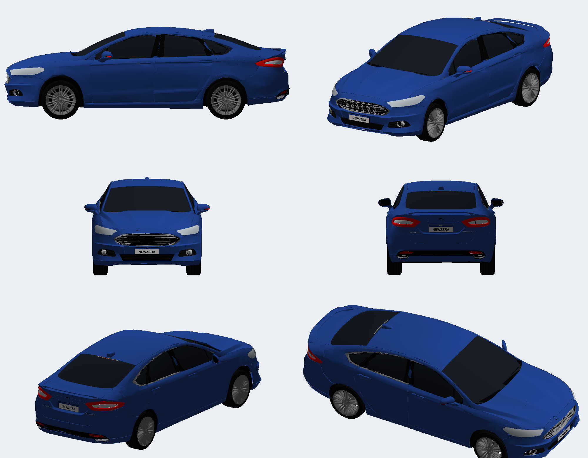 |

O leitor/escritor de GEOMETRY foi validado reescrevendo o Escort RS: estrutura idêntica chunk a chunk.
O compressor JDLZ foi validado com ida e volta contra o descompressor que lê os blobs do Escort.

## Limites conhecidos

- O 2018 v10.16 foi aprovado no slot Mustang, com friso metálico em gradiente, lentes brancas claras e tampa mais leve. A validação corresponde ao cenário testado pelo usuário no jogo.
- No 2012, a exibição das luzes permanece pendente. Sua release é um port de desenvolvimento, sem aprovação visual completa.
- No 2012, o para-choque traseiro e as lanternas externas estão em TRUNK e acompanham a tampa na tela de som.
- A abertura da tampa usa o pivô do slot e ainda não foi relatada especificamente após o reparo.
- O interior perdeu o assoalho (Z < 0,30) para preservar o orçamento da BASE; as peças de freio não entram.
- Os nomes/logos no menu continuam os dos slots. VINYLS.BIN e PARTS_ANIMATIONS.bin continuam os do jogo.
