# Ford Fusion — Need for Speed Underground 2

Dois ports, a partir dos ZIPs do Most Wanted 2005. Os arquivos de lá não são alterados. A estrutura que o Underground 2 aceita foi medida no **Escort RS**.

| Most Wanted | Underground 2 | Carro |
| --- | --- | --- |
| `MUSTANGGT` | `MUSTANGGT` | Fusion Titanium 2018 AWD |
| `COBALTSS` | `FOCUS` | Fusion 2012 FWD |

O 2012 reaproveita o caminho do 2018 (corte, vidros, adesivos, vinil, chassi). O que muda é o slot e a tração, dianteira no 2012. O método está em [docs/PORTAR-PARA-NFSU2.md](docs/PORTAR-PARA-NFSU2.md).

> **Estado:** a v9 do 2018 foi aprovada no jogo em 27/09/2026 (pintura LOD B + LOD A nas áreas que deformavam, sem o emblema do bico, 248 cv, tração integral, chassi do Lancer). Ela substitui o Mustang GT: no Underground 2 o slot também se chama `MUSTANGGT`, em `CARS/MUSTANGGT`. O 2012, quando for gerado, ocupa o `FOCUS`. O histórico está em [TODO.md](TODO.md).

## No jogo

| Garagem | Cidade |
| --- | --- |
|  |  |
|  |  |


## O que entra no jogo

| Arquivo | Conteúdo |
| --- | --- |
| `CARS/MUSTANGGT/GEOMETRY.BIN` | peças que o slot MUSTANGGT desenha: `KIT00_BODY_A`, `KITW01–04_BODY_A`, `KIT00_TRUNK_A`, `BASE_A`, `KIT00_FRONT_WHEEL_A` e os adesivos |
| `CARS/MUSTANGGT/TEXTURES.BIN` | 15 texturas sem compressão (RAWW). Opacas em DXT1; lentes, sombras e neon em DXT3 |
| `GLOBAL/GlobalB.lzc` | registro `MUSTANGGT` alterado (rodas, massa, inércia, motor, câmbio, tração, chassi). Editado no próprio arquivo do jogo |

`VINYLS.BIN` e `PARTS_ANIMATIONS.bin` continuam os do jogo.

### Peças

| Peça UG2 | Origem (MW z10) | Triângulos |
| --- | --- | --- |
| `KIT00_BODY_A` e `KITW01–04` | pintura LOD B nas áreas planas + LOD A no bico, na frente do teto e no para-choque traseiro. As cinco carrocerias são a mesma malha | 21.228 |
| `KIT00_TRUNK_A` | tampa do porta-malas em LOD A, com a lanterna central | 18.021 |
| `BASE_A` | base, capô LOD B (só a face de cima), bico e frente do teto em LOD A, vidros, faróis, lanternas, interior e motorista | 21.255 |
| `KIT00_FRONT_WHEEL_A` | roda de 20 raios, aro 18" (LOD B) | 8.614 |

Cada peça fica em até 21.500 triângulos (64.500 índices). A v1, com até 62.886 índices concentrados, fechou o jogo.

### A malha nas imagens

Azul é `KIT00_BODY_A`. Cinza é `BASE_A`: capô, frente do teto, vidros, faróis e lanternas. Laranja é `KIT00_TRUNK_A`. A roda preta está nos quatro arcos medidos na malha. Os quatro `KITW` repetem a malha azul e ficam de fora deste render. A imagem sai do `GEOMETRY.BIN` instalado.

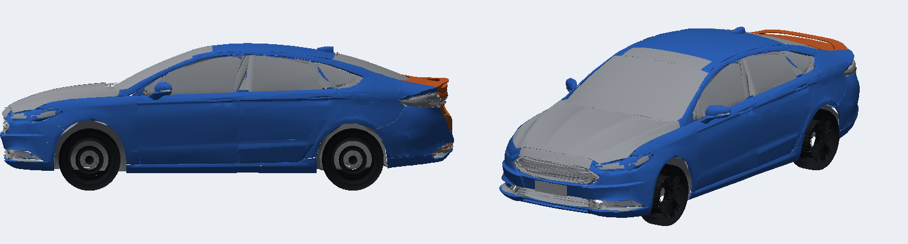

A v9 inteira, nas seis vistas de `scripts/preview.py`. Magenta é face de costas ou a lente; o para-lama por dentro sai verde.

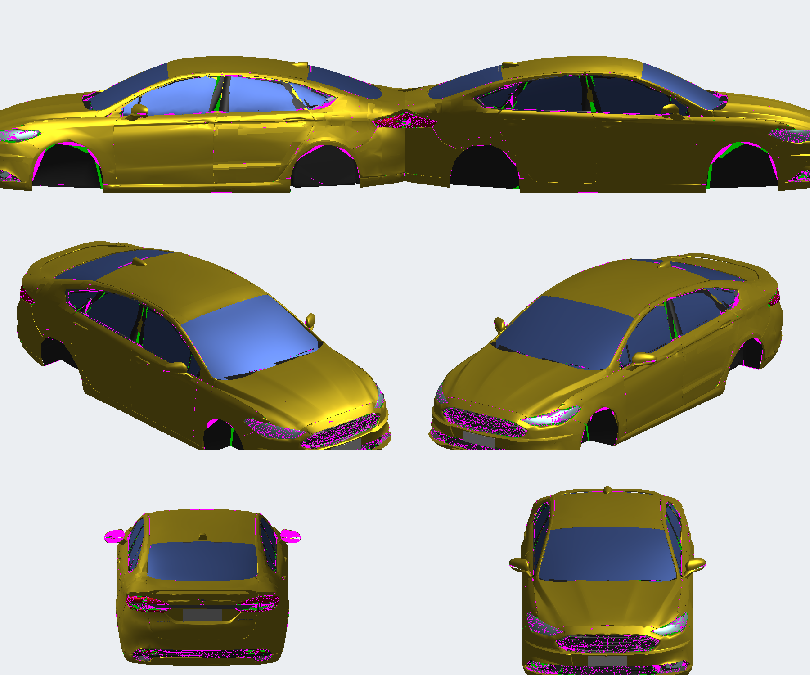

| Uma lâmina de vidro por janela | Pintura no molde de vinil do Focus |
| --- | --- |
| 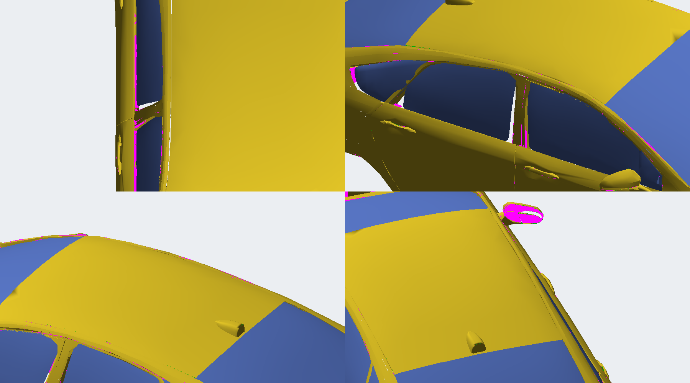 | 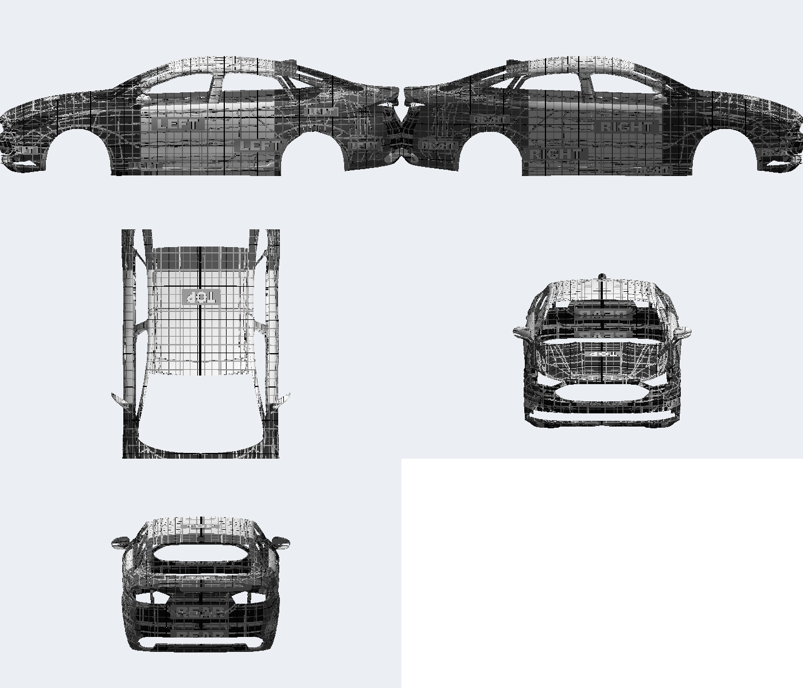 |

| As cinco carrocerias são a mesma malha | v8: pintura em peças que o slot não desenha |
| --- | --- |
| 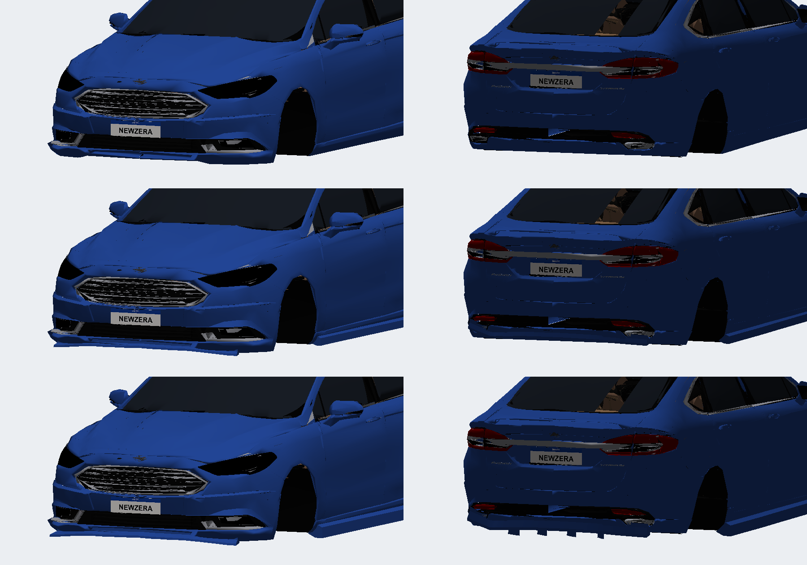 |  |

### Da v3 à v5

A v3 decimou a pintura. Magenta é face de costas ou buraco: o capô, o teto e a coluna ficaram partidos.

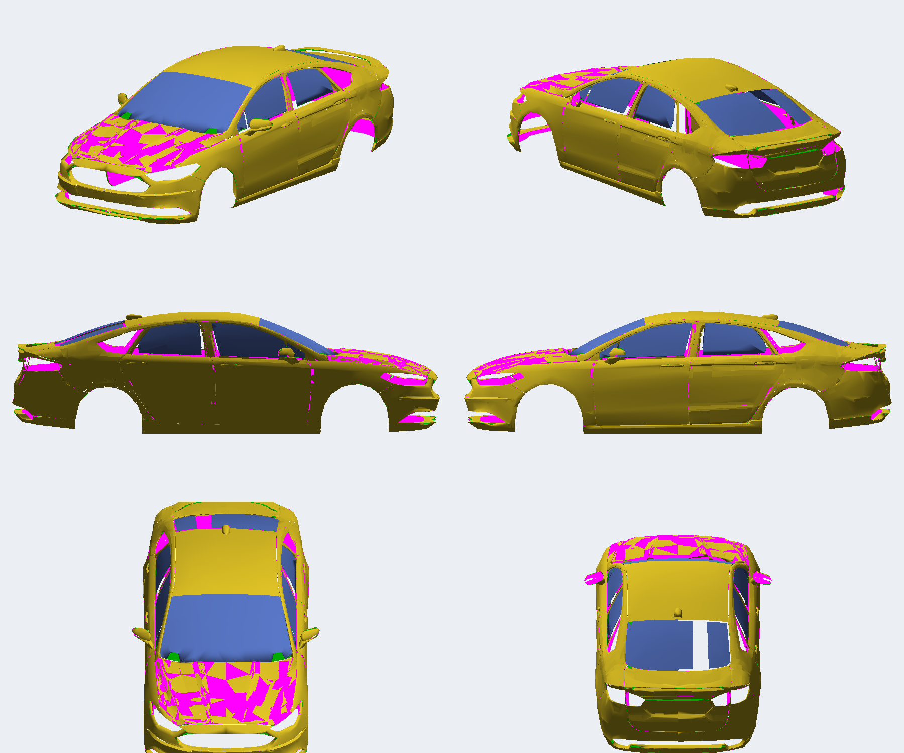

A v4 fechou essa lataria e devolveu o vidro traseiro que vinha do Most Wanted. As faixas douradas são o `REAR_WINDOW` de origem. A v5 substituiu o vidro decimado por uma lâmina nova em cada janela.

| Vidro traseiro do MW, com a faixa que faltava | As lâminas da v5, sem a carroceria |
| --- | --- |
| 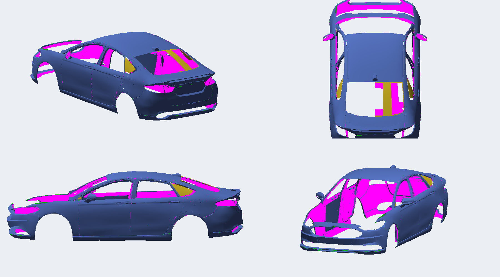 | 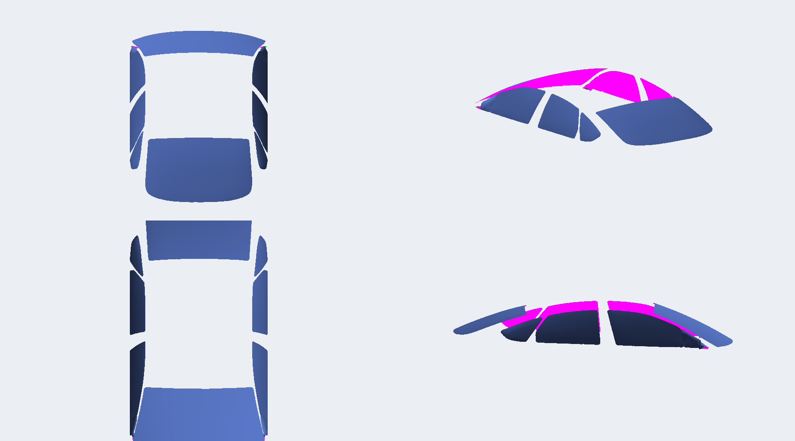 |

Na v4 o para-lama por dentro já sai verde e o miolo da lataria deixa de ser mancha magenta.

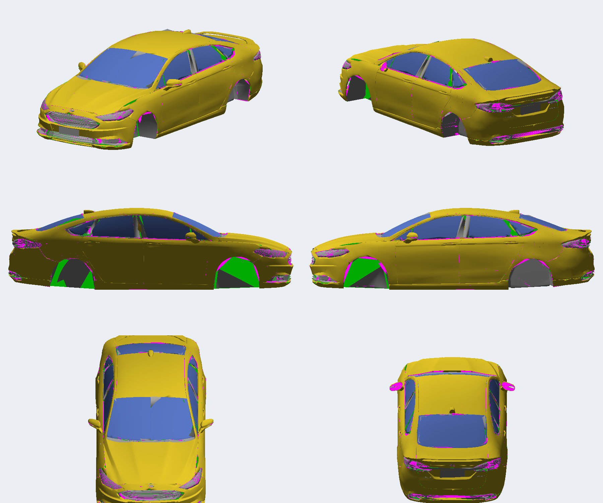

### Bico, tampa, adesivos e molde

| Rebaixo do emblema, preenchido na pintura | Tampa e lanternas da malha aprovada |
| --- | --- |
| 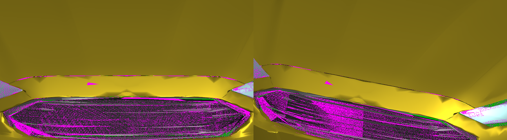 | 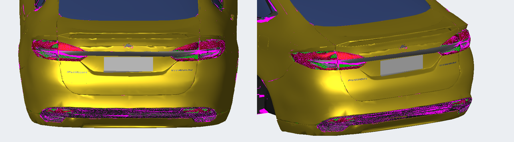 |

| Molde de vinil do Focus, antes de projetar a pintura | Lanternas lidas do Most Wanted |
| --- | --- |
| 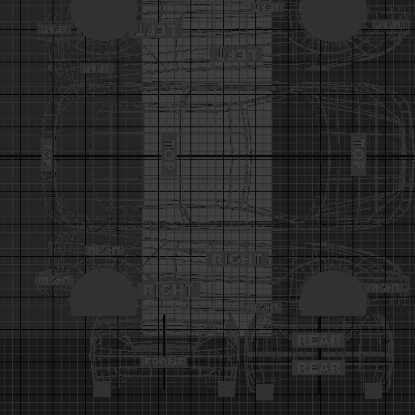 | 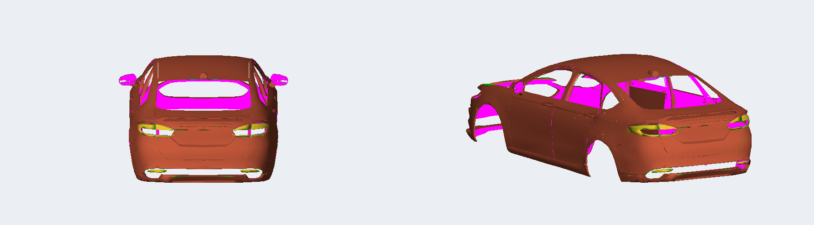 |

As faixas coloridas são as peças `DECAL`, não a pintura. Elas sentam no para-brisa, no capô e nas portas. No centro do para-brisa a v6 ainda mostra a emenda das duas lâminas.

| Adesivos de teste na v6 | Emenda do para-brisa |
| --- | --- |
| 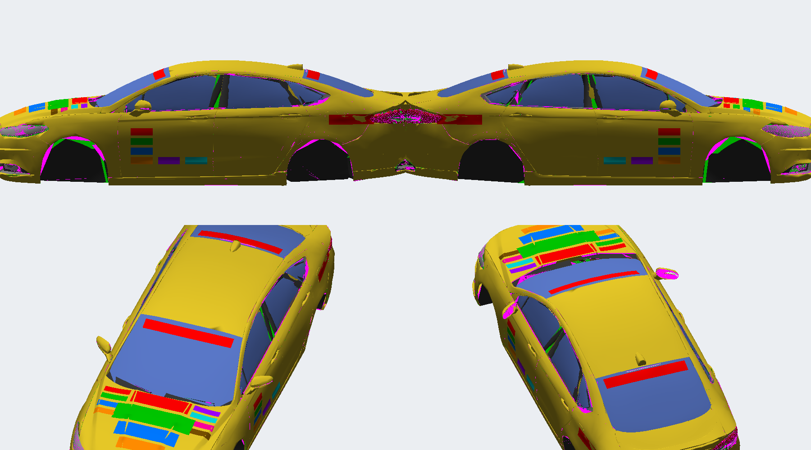 | 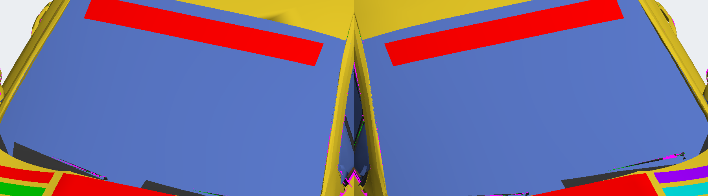 |

## Aprendizados aplicados (do MW2005 e deste port)

1. **Limite de índices por peça.** O UG2 fecha o jogo quando uma peça passa de 65.535 índices
   (~21.800 triângulos). O LOD A do Fusion tem ~190 mil triângulos, e o slot FOCUS só desenha
   carroceria, base, porta-malas, roda e adesivos. A pintura foi repartida nessas peças
   (≤ 21.500 triângulos), sem truncar a malha:
   - áreas planas ficam no LOD B; o bico, a frente do teto e o para-choque traseiro usam o LOD A,
     com corte exato (`scripts/clip.py`). Decimar o LOD B por QEM deformava o encontro para-lama/porta;
   - os vidros são uma lâmina nova por janela (`scripts/newglass.py`); o interior foi reduzido para
     caber o LOD A na base. A mancha magenta da v3 e o fechamento na v4 estão na seção anterior.
2. **DXT1 para peças opacas.** DXT3 desliga a gravação de profundidade (lição da grade do MW).
   MISC, LOGO, INTERIOR, BADGING, roda, pneu, motorista e as carcaças dos faróis/lanternas são DXT1.
   As lentes usam uma cópia DXT3 separada da mesma folha e ficam por último na ordem de desenho.
3. **Kits não podem sumir com o carro.** As 4 carrocerias `KITW` existem (carros da IA aplicam
   kits aleatórios).
4. **Rodas pela geometria, não por chute.** Os arcos dos para-lamas foram medidos na malha:
   dianteira X = +1,431, traseira X = −1,311 (entre-eixos 2,74 m), Y = ±0,78, Z = 0,13,
   raio 0,3225 (235/40 R18), largura 0,235. O port anterior gravava 3,3 m de entre-eixos.
5. **Marcadores** (faróis, lanternas, brake light central, escapamentos, aerofólio, entrada de ar do
   teto) vêm das posições aprovadas no MW; no UG2 o lado esquerdo é +Y.

## Performance (`scripts/globalb_patch.py`)

- **Motor e câmbio do Toyota Corolla levados a 248 cv** (o 2.0 EcoBoost do Fusion Titanium 2018): todas as
  curvas de torque (estoque, turbo e upgrades) ×2,212; giro e relações do Corolla. Pela curva: 248 cv
  (245 hp) a 6.560 rpm e 288 Nm (Corolla ~111 hp / 130 Nm; Focus original ~125 hp / 182 Nm).
- **Tração integral**: divisão de torque 0,5 (valor do Lancer Evo VIII), no estoque e nos 3 níveis.
- **Dirigibilidade do Lancer Evo VIII**: pneus, suspensão, direção, freios e tabelas de upgrade;
  massa 1,63 t (Focus 1,15 t, Corolla 0,97 t, Lancer 1,40 t).
- Altura da roda (Z 0,0975), raio 0,3075 e largura 0,195 continuam os do Escort, aprovados no jogo.
- **Carro longo**: dimensões 4,73 × 1,85 × 1,46 m e inércia recalculada a partir delas
  (guinada 3,01 contra 2,67 do Evo), além do entre-eixos de 2,74 m (o Focus tinha 2,54 m).

Valores finais em `docs/globalb_focus.json`.

## Instalação

Feche o jogo e execute `instalar.bat` (na release ele fica ao lado de `CARS`; no repositório, `release/instalar.bat`). O script procura o Underground 2, copia `CARS/MUSTANGGT` e aplica no `GLOBAL/GlobalB.lzc` o mesmo ajuste de `scripts/globalb_patch.py` no registro `MUSTANGGT`: 248 cv, tração integral e chassi do Lancer. Na primeira execução o GlobalB anterior fica em `GLOBAL/GlobalB.lzc.antes-fusion`. Se o arquivo estiver compactado (JDLZ), salve-o descompactado no Nikki e rode de novo.

O backup do estado anterior desta cópia (Escort RS + GlobalB) está em `backup/antes-fusion-2026-09-25` (fora do git).

| Arquivo instalado | SHA-256 |
| --- | --- |
| `CARS/MUSTANGGT/GEOMETRY.BIN` | `8AADFE92E374B52A95728E86887C3547DB4526013DAEA451829D66E986F1E59D` |
| `CARS/MUSTANGGT/TEXTURES.BIN` | `D1750123BFB8914F56CFC5FB2922C82E9959C998F3AE0662DB993DA5572350E6` |
| `GLOBAL/GlobalB.lzc` | `689B5935A0E1D8C89F3CFB3959F1FF2E4742760AA31E56CB8AC249A7DB9B2462` (rodas + performance; o anterior, só com as rodas, está em `backup/v9-antes-performance/`) |

## Reconstruir

Python 3 + numpy + Pillow. `mw/` é o ZIP da release do Most Wanted extraído. O molde de textura é o `CARS/MUSTANGGT/TEXTURES.BIN` do 2018.

```
python extract_mw.py 2018     # MUSTANGGT -> mw_parts.pkl e texdump/
python build.py out 2018      # peças MUSTANGGT_*
python extract_mw.py 2012     # COBALTSS, mesma pipeline do 2018
python build.py out 2012      # peças FOCUS_*
python globalb_patch.py GlobalB.lzc out/GlobalB.lzc 2018
python preview.py out/GEOMETRY.BIN out/TEXTURES.BIN previa.png
```


O leitor/escritor de GEOMETRY foi validado reescrevendo o Escort RS: estrutura idêntica chunk a chunk.
O compressor JDLZ foi validado com ida e volta contra o descompressor que lê os blobs do Escort.

## Limites conhecidos

Aprovado na garagem, no modo exploração e na largada: carroceria completa (teto, portas e capô), faróis, lanternas e rodas dentro dos arcos.

- Freios (`KIT00_FRONT/REAR_BRAKE_A`) não entram.
- Na tela de som o jogo anima a `TRUNK_A` com o pivô do Focus.
- Logo da tela de seleção (`FrontB.lzc`) e o nome no menu continuam os do Escort/Focus.
- O `VINYLS.BIN` do slot continua o do Focus; a pintura usa a UV projetada no molde dele.
