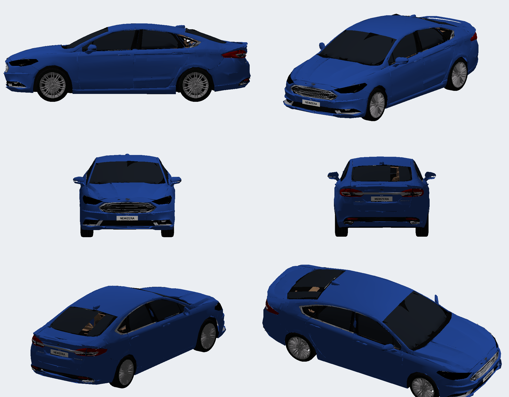

# Ford Fusion Titanium 2018 AWD — Need for Speed Underground 2

Substitui o **Ford Focus** (slot `FOCUS`). O modelo vem do port aprovado de Most Wanted 2005
(`fusion-mw2005`, V1prime-z10); os arquivos de lá não foram alterados. O doador de estrutura é o
**Escort RS** (`source/Ford-Focus-ESCORT-RS`), o mod sedã que já funciona neste jogo.

> **Estado:** a v9 (instalada) usa pintura LOD B + LOD A nas áreas que deformavam (só nas peças que o slot desenha: carroceria, base, porta-malas), tira o emblema do bico e mapeia a pintura no molde de vinil do Focus; aguarda teste. Detalhes em [TODO.md](TODO.md).



## O que entra no jogo

| Arquivo | Conteúdo |
| --- | --- |
| `CARS/FOCUS/GEOMETRY.BIN` | 7 peças no layout do Escort RS (compilador nfsu360): `KIT00_BODY_A`, `KITW01–04_BODY_A`, `BASE_A`, `KIT00_FRONT_WHEEL_A` |
| `CARS/FOCUS/TEXTURES.BIN` | 15 texturas (JDLZ, como o Escort). Opacas em DXT1; só as lentes de farol/lanterna em DXT3 |
| `GLOBAL/GlobalB.lzc` | registro `FOCUS` alterado (rodas, massa, inércia, motor, câmbio, tração, chassi). Editado no próprio arquivo do jogo |

`VINYLS.BIN` e `PARTS_ANIMATIONS.bin` continuam os do jogo.

### Peças

| Peça UG2 | Origem (MW z10) | Triângulos |
| --- | --- | --- |
| `KIT00_BODY_A` (padrão) e `KITW03` | carroceria LOD C + capô LOD C (14.000) + vidros (1.500) | 15.500 |
| `KITW01` ("Street": lábio, saias, lábio traseiro) e `KITW04` | KIT01 LOD C + capô + vidros | 15.500 |
| `KITW02` ("Race": splitter, saias, difusor) | KIT02 LOD C + capô + vidros | 15.499 |
| `BASE_A` | base LOD C (grade, frisos, chassi, placas, emblemas) + interior + motorista + faróis e lanternas (LOD C) | 15.435 |
| `KIT00_FRONT_WHEEL_A` | roda de 20 raios aro 18" (LOD B) | 8.614 |

Todas com no máximo 46.500 índices e 19 mil vértices por peça (a v1, com até 62.886 índices, fechou o jogo).

## Aprendizados aplicados (do MW2005 e deste port)

1. **Limite de índices por peça.** O UG2 fecha o jogo quando uma peça passa de 65.535 índices
   (~21.800 triângulos). O LOD A do Fusion tem ~190 mil triângulos. O port anterior *truncava* as
   malhas; aqui a malha não é cortada:
   - carroceria e base usam o **LOD C autoral do GTA V** (liso, sem facetas); decimar o LOD B por
     QEM deformava o encontro para-lama/porta (as "manchas" do MW voltavam);
   - vidros (12 mil → 2.300) e interior (18,5 mil → 7.600) passam por decimação que preserva
     costuras de UV, bordas e troca de material (`scripts/decimate.py`), com normais recalculadas.
2. **DXT1 para peças opacas.** DXT3 desliga a gravação de profundidade (lição da grade do MW).
   MISC, LOGO, INTERIOR, BADGING, roda, pneu, motorista e as carcaças dos faróis/lanternas são DXT1.
   As lentes usam uma cópia DXT3 separada da mesma folha e ficam por último na ordem de desenho.
3. **Kits não podem sumir com o carro.** As 4 carrocerias `KITW` existem (carros da IA aplicam
   kits aleatórios).
4. **Rodas pela geometria, não por chute.** Os arcos dos para-lamas foram medidos na malha:
   dianteira X = +1,431, traseira X = −1,311 (entre-eixos 2,74 m), Y = ±0,78, Z = 0,13,
   raio 0,3225 (235/40 R18), largura 0,235. O port anterior gravava 3,3 m de entre-eixos.
5. **Marcadores** (faróis, lanternas, brake light central, escapamentos, aerofólio, entrada de ar do
   teto) vêm das posições aprovadas no MW; no UG2 o lado esquerdo é +Y.

## Performance (`scripts/globalb_patch.py`)

- **Motor e câmbio do Toyota Corolla levados a 248 cv** (o 2.0 EcoBoost do Fusion Titanium 2018): todas as
  curvas de torque (estoque, turbo e upgrades) ×2,212; giro e relações do Corolla. Pela curva: 248 cv
  (245 hp) a 6.560 rpm e 288 Nm (Corolla ~111 hp / 130 Nm; Focus original ~125 hp / 182 Nm).
- **Tração integral**: divisão de torque 0,5 (valor do Lancer Evo VIII), no estoque e nos 3 níveis.
- **Dirigibilidade do Lancer Evo VIII**: pneus, suspensão, direção, freios e tabelas de upgrade;
  massa 1,63 t (Focus 1,15 t, Corolla 0,97 t, Lancer 1,40 t).
- Altura da roda (Z 0,0975), raio 0,3075 e largura 0,195 continuam os do Escort, aprovados no jogo.
- **Carro longo**: dimensões 4,73 × 1,85 × 1,46 m e inércia recalculada a partir delas
  (guinada 3,01 contra 2,67 do Evo), além do entre-eixos de 2,74 m (o Focus tinha 2,54 m).

Valores finais em `docs/globalb_focus.json`.

## Instalação

Já está instalado. Para reinstalar em outra cópia do jogo: feche o jogo, copie `CARS/FOCUS` e rode
`scripts/globalb_patch.py GlobalB.lzc GlobalB.lzc.novo` sobre o `GLOBAL/GlobalB.lzc` descompactado.
O backup do estado anterior (Escort RS + GlobalB) está em `backup/antes-fusion-2026-09-25`
(fora do git).

| Arquivo instalado | SHA-256 |
| --- | --- |
| `CARS/FOCUS/GEOMETRY.BIN` | `4E731163C867DE8E8787F7C0ED0F624130818FD95A2DA5B72080EDAEB472C2CB` |
| `CARS/FOCUS/TEXTURES.BIN` | `830FD72B7A4A1BAFC061FAABF5AC843722C62C81CB6AF5D4594C94839646457F` |
| `GLOBAL/GlobalB.lzc` | `689B5935A0E1D8C89F3CFB3959F1FF2E4742760AA31E56CB8AC249A7DB9B2462` (rodas + performance; o anterior, só com as rodas, está em `backup/v9-antes-performance/`) |

## Reconstruir

Python 3 + numpy + Pillow. A partir de uma pasta com `mw/` (ZIP da release do MW) e `escort/`
(conteúdo de `FOCUS.7z`, extraível com `scripts/sevenz.py`):

```
python extract_mw.py          # lê o GEOMETRY/TEXTURES do MW -> mw_parts.pkl e texdump/
python build.py out           # GEOMETRY.BIN + TEXTURES.BIN
python globalb_patch.py GlobalB.lzc out/GlobalB.lzc
python preview.py out/GEOMETRY.BIN out/TEXTURES.BIN previa.png
```

O leitor/escritor de GEOMETRY foi validado reescrevendo o Escort RS: estrutura idêntica chunk a chunk.
O compressor JDLZ foi validado com ida e volta contra o descompressor que lê os blobs do Escort.

## Limites conhecidos / não testado

- Não foi aberto no jogo. Pontos a conferir: rodas dentro dos arcos (se ficarem para fora/dentro,
  ajuste Y no Nikki), sombra, brilho de faróis/lanternas.
- Freios e porta-malas (`TRUNK_A`) não entram (o Escort também não tem).
- Logo da tela de seleção (`FrontB.lzc`) e nome no menu continuam os do Escort/Focus.
- Adesivos: o `VINYLS.BIN` do slot foi feito para a UV do Focus; o mapa da pintura é o do MW.
