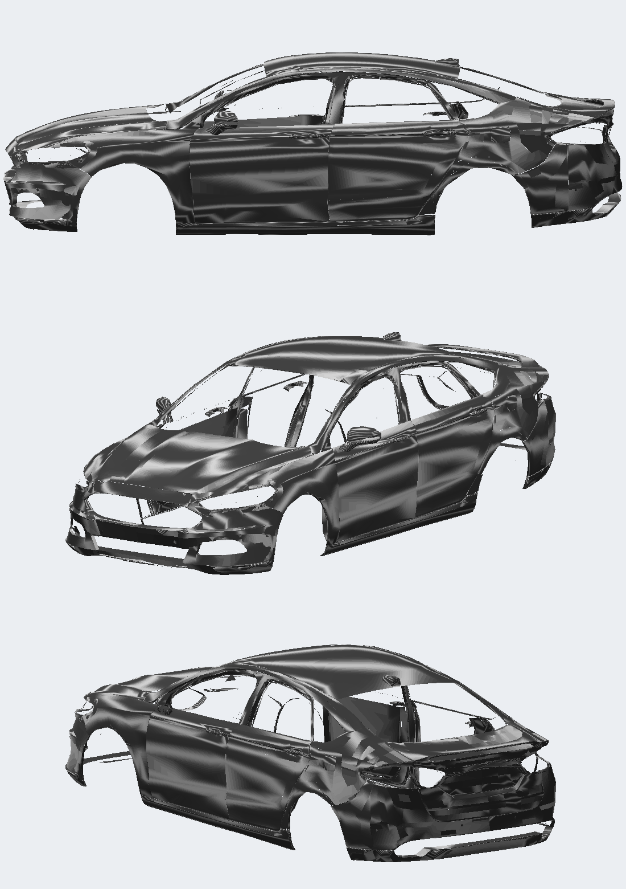
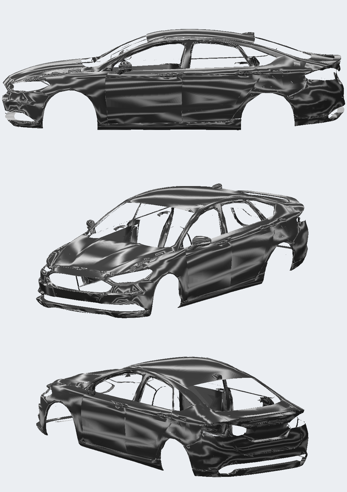

# Carroceria do 2012 mais lisa — v12

Pedido do usuário (07/10/2026): a lataria do 2012 aparecia craquelada perto dos faróis, na lateral, nas portas e no para-lama traseiro.

## Causa

O orçamento do 2012 obriga a decimar a pintura LOD B de 21.049 para 15.200 triângulos. A decimação recalculava as normais a partir das faces simplificadas. Na exportação, outras 2.352 normais do BODY eram trocadas pela normal dura das faces. O shader de pintura do UG2 reflete o ambiente pela normal de cada vértice, então essas normais irregulares viram manchas e blocos.

## Correção

`normals_from_A` em `scripts/ports.py` / `smooth.transfer_normals`: cada vértice da pintura (BODY, TRUNK, capô e bico) recebe a média, ponderada pela distância, das normais originais do LOD A em até 3 cm. Entram só as normais que concordam com a face do vértice, o que preserva vincos e o outro lado de painéis finos. Posições, triângulos, UVs, grupos e texturas não mudam; só as normais. O tamanho dos BIN é idêntico, então a memória do carro não muda.

Variantes testadas e descartadas: normais recalculadas da superfície LOD A (mais ruído na frente e na traseira) e relaxamento entre vizinhos (blocos mais planos).

| Antes (v11.1) | Depois (v12) |
| --- | --- |
|  |  |

Prévia com listras de ambiente refletidas pelas normais, para expor ondulações: `python scripts/preview_paint.py GEOMETRY.BIN saida.png`. Ela não reproduz o shader do jogo.

Instalado no slot FOCUS, com backup em `backup/antes-v12-2012/`. GEOMETRY `93F5EEC7A0D6EDBA7AA38A09813DED47ED1FD5C03DA134F83D074B8B615F51F6`; TEXTURES igual à v11.1.

## v12.1 — frente e traseira do 2012, lateral do 2018

O usuário aprovou a v12: "o craquelado melhorou bastante, o carro está com a superfície bem lisa". Ainda havia craquelado na frente do 2012 (capô, para-choque e para-lamas, perto dos faróis) e na traseira, que estava pior que a do 2018.

Diagnóstico: depois da transferência, cerca de 1.160 vértices da pintura no BODY e 810 no TRUNK ainda tinham normais trocadas pela média das faces na exportação. Em mais da metade deles a troca invertia a normal. Faces da malha decimada estavam com a orientação contrária à das normais, e dobras da malha geravam médias sem sentido. Com as duas faces desenhadas, isso aparecia como manchas escuras.

- `orient_paint`: as faces da pintura passam a seguir as normais do LOD A. Foram viradas 423 faces no BODY e 326 no TRUNK. Para a pintura, a correção da exportação deixou de substituir normais.
- `normals_relax_regions` (somente 2012): 12 passes de suavização das normais na frente (X > 1,2) e na traseira (X < −1,5). Vincos acima de 35° são preservados.
- 2018: o mesmo `normals_from_A` + `orient_paint`. A tampa recebe as normais do LOD A depois da decimação para 6.000 faces.

Em todos os sólidos, a forma (conjunto de triângulos) e as texturas são idênticas às da v1.4. Só a orientação e as normais mudaram, além de 1 triângulo a menos na decimação da tampa do 2018, e as contagens de vértices diminuíram levemente. Backup em `backup/antes-v12.1/`.

| 2012 v12.1 | 2018 antes | 2018 v12.1 |
| --- | --- | --- |
|  |  |  |
