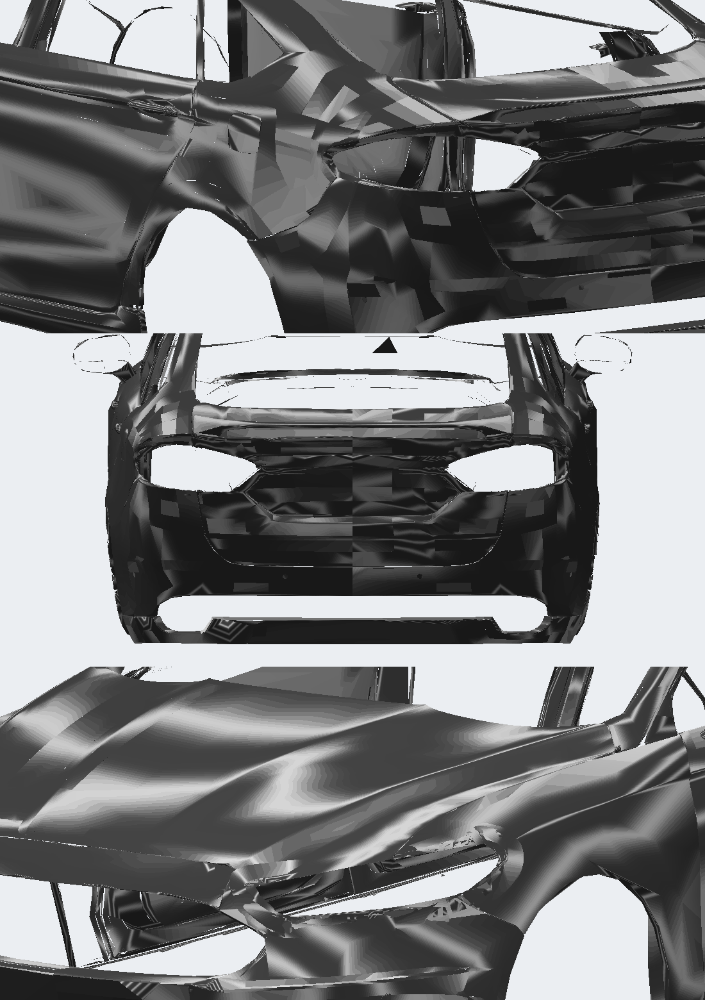
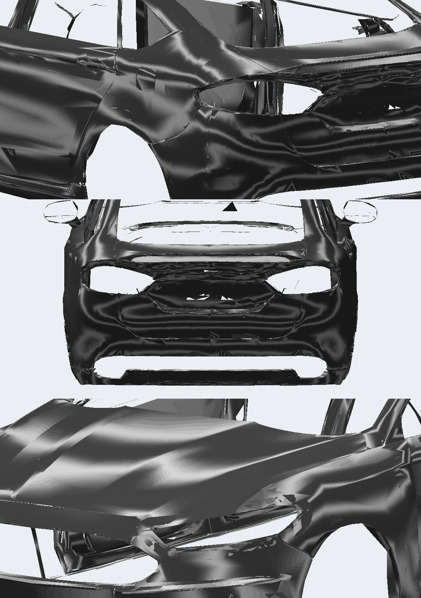
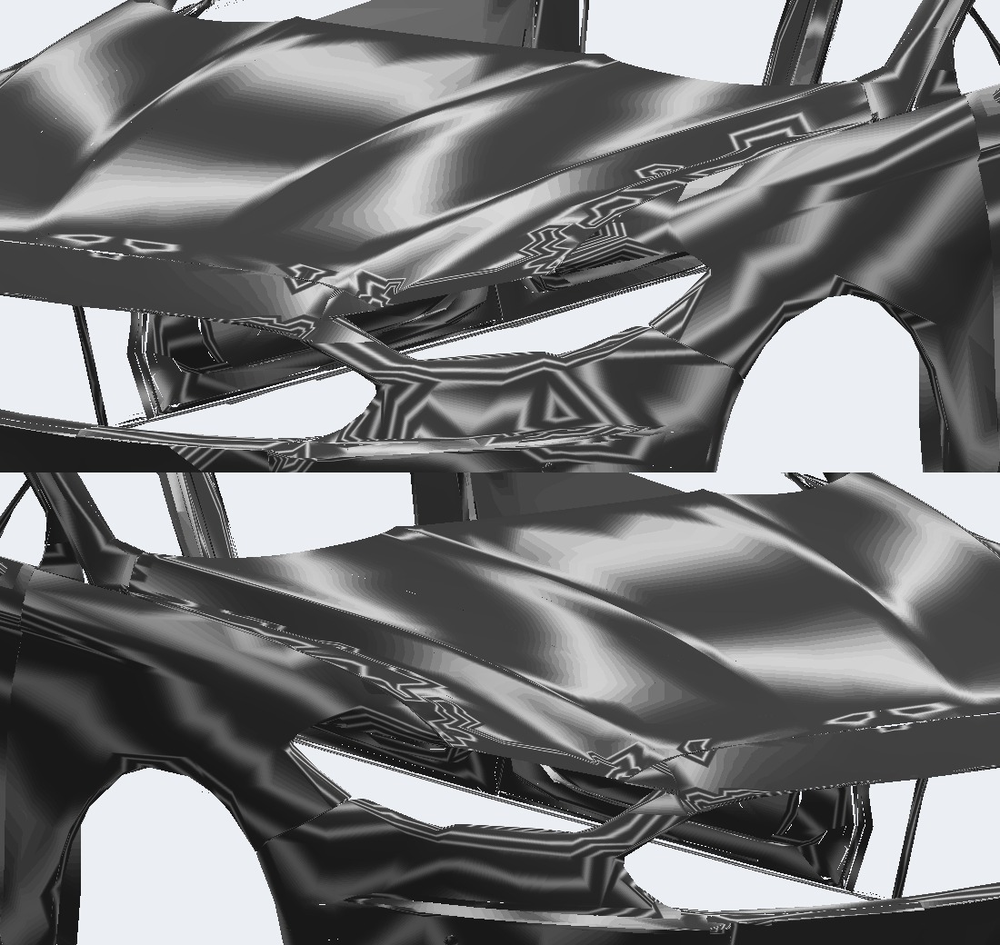
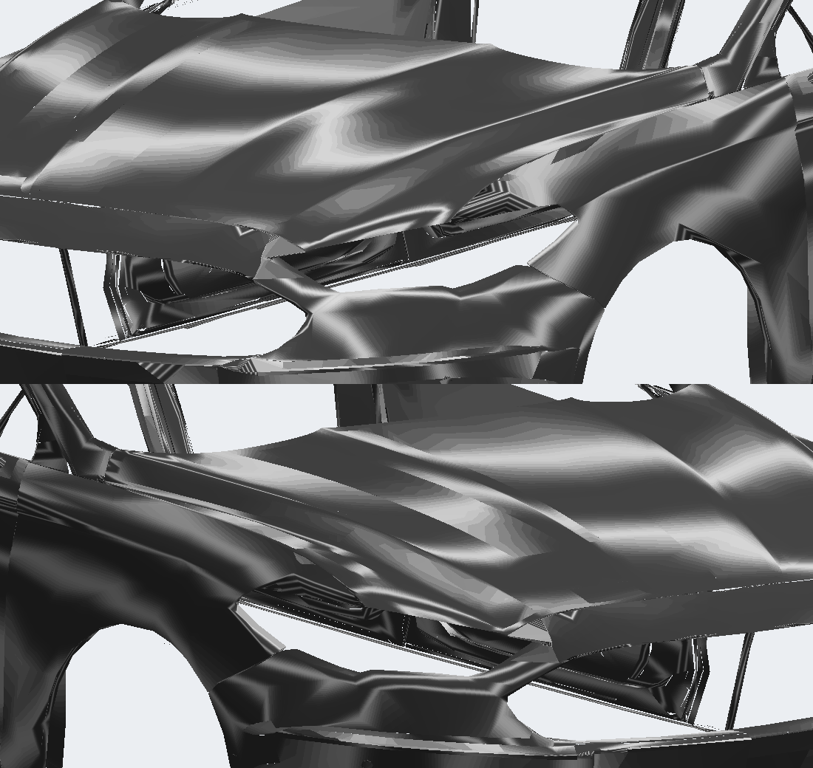

# Carroceria v12.2 — traseira do 2012 em LOD A, frentes suavizadas e lanternas

O usuário aprovou a lateral lisa do v12.1 e apontou o que ainda faltava:

- pequenos craquelados perto dos faróis, no 2012 e no farol do motorista do 2018;
- a traseira do 2012 parecia de baixa resolução e craquelada, longe da do 2018;
- o para-lama traseiro do 2012 estava craquelado;
- manchas escuras na lanterna do 2012, no vermelho e no branco;
- os refletores acima dos escapes estão corretos no 2012 e errados no 2018.

## 2012

- **Traseira:** tampa e para-choque passam a vir do LOD A, decimados para 14.800 faces, como a tampa do 2018. Antes vinham do LOD B. O LOD A tem uma abertura no rebaixo da placa, que o MW cobre com a placa dele. Ela é fechada com as faces do LOD B que ficam a mais de 8 mm do LOD A, só dentro do rebaixo: 872 faces, removidas depois pela mesma decimação. O relaxamento da traseira (v12.1) saiu, porque deixava blocos no jogo.
- **Para-lama traseiro e lateral:** a pintura plana passa a ser decimada a partir do LOD A (57.597 → 15.200), e não mais do LOD B (21.049 → 15.200).
- **Faróis:** relaxamento das normais na frente aumentado para 28 passes, preservando vincos acima de 45°. Na borda da abertura do farol ainda há pequenos triângulos da própria malha.
- **Lanternas:** a lente vermelha era desenhada dos dois lados. Com as duas faces visíveis no jogo, a cópia interna ficava sobre a externa e gerava manchas. Agora fica uma camada só, voltada para fora (`lens_brake: outward`), sem as faces opostas coincidentes. Isso também liberou 1.600 triângulos para a traseira em LOD A.

O TRUNK passou de 20.148 para 20.122 triângulos e o BODY continua com 20.957. O total de vértices sobe 1,5% (2.675, quase todos repetidos nas cinco carrocerias KITW). As texturas são idênticas.

## 2018

- **Faróis:** o mesmo relaxamento na frente, com 16 passes.
- **Refletores:** passam a usar o tratamento aprovado no 2012, com só a camada externa e uma normal plana por refletor: 85 triângulos, removidos 101 internos. O total de triângulos é o mesmo da v1.4; as texturas são idênticas.

## Prévias

| 2012 antes (v12.1) | 2012 depois (v12.2) |
| --- | --- |
|  |  |

| 2018, faróis antes | 2018, faróis depois |
| --- | --- |
|  |  |

Instalado nos dois slots, com backup em `backup/antes-v12.2/`.
