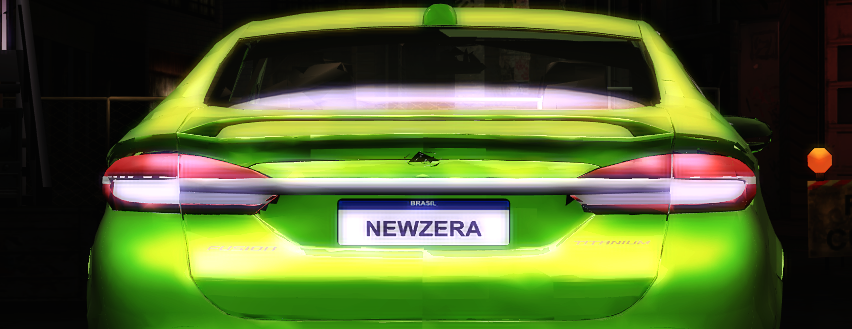
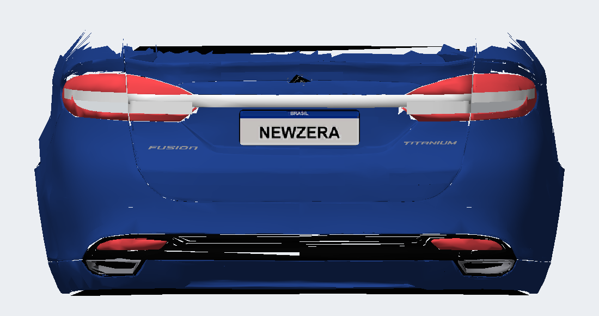
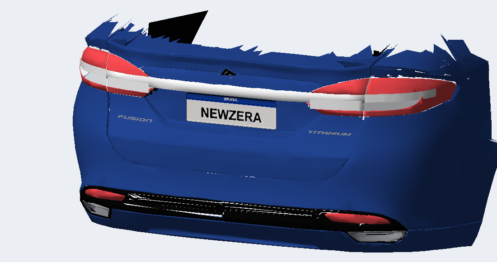

# Ajuste interno v10.11 — friso externo e branco inferior

Em 06/10/2026, o usuário informou que a v10.10 não mudou o suficiente:

A continuação externa do friso passou de 19 para 34 mm de altura, mantendo as duas peças externas em BASE. Em cada coluna Y, o novo painel consulta as interseções da lente e fica 4 mm à frente do menor X encontrado. A profundidade constante no pequeno trecho vertical evita um lábio voltado para baixo. A curva lateral continua acompanhando a lente.

Nos dois painéis abaixo do friso, em TRUNK, a consulta de profundidade agora inclui o friso original, além da lente. Assim, o branco não depende somente do fundo da lente, que pode ficar atrás da borda inferior do friso. Faixa interna Z 0,662–0,704; borda vermelha inferior preservada. Mesma célula branca e material opaco da versão anterior, sem cópias de faces opostas.

Build em `local/v10.5/out-lamps-visible-trim/`, instalada para teste. A aparência ainda depende de confirmação no jogo. Validação de índices, limites, referências de textura, opacidade, roda e chamadas de peças passou. Total 63.066 vértices / 60.003 triângulos. Backup anterior em `backup/antes-v10.11/`. Os BIN da release existente não foram alterados por esta tentativa.

GEOMETRY: `DF7DC386D9A1B766A02AD8996C9EE2D61B6CE8B07F2D385EA633EAC9053E2A02`. TEXTURES inalterado: `92B437E1BE6B57CD9FEBDD4425920BBC70F9649D9D04576BBFAF20C2B896C50B`.
