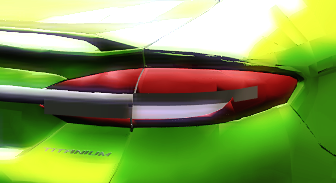
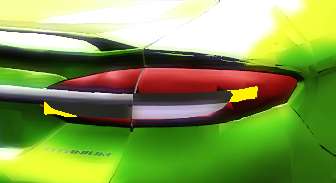

# Reversão do tamanho do friso — v10.12

O usuário mostrou excessos nas pontas e na borda inferior do friso experimental v10.11. A ampliação foi revertida: a continuação externa volta ao recorte Z 0,710–0,729 sobre as lentes existentes, e o detalhe branco inferior ao recorte Z 0,663–0,688. Removida a geração de painéis `front_sheet` que criava as projeções indesejadas.

O atlas não mudou: o friso usa RGB 255/255/255 e alfa 255; o fundo branco das lentes usa RGB 238/240/242. O aspecto cinza no jogo não permite concluir que a textura seja cinza: material, normais e iluminação também influenciam a aparência. Aprendizado: não aumentar a geometria para compensar escurecimento. Ajustes de aparência devem respeitar o contorno existente e ser avaliados no jogo.

Reconstrução idêntica à v10.10: GEOMETRY SHA-256 `A9E01CD5F50556FDA8B0601119C8166A631A2127314BDCF82D0987F25E0B7B28`; TEXTURES `92B437E1BE6B57CD9FEBDD4425920BBC70F9649D9D04576BBFAF20C2B896C50B`. Validação passou para limites, índices, referências de texturas, opacidade, rodas e chamadas de peças.

Instalada no slot MUSTANGGT do jogo. Backup anterior em `backup/antes-v10.12/CARS/MUSTANGGT/`; candidato em `local/v10.5/out-lamps-reverted-size/`. Arquivos da release preservados. Contorno restaurado ainda aguarda confirmação visual do usuário.
