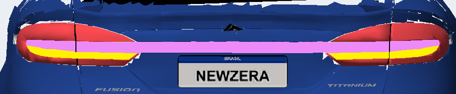
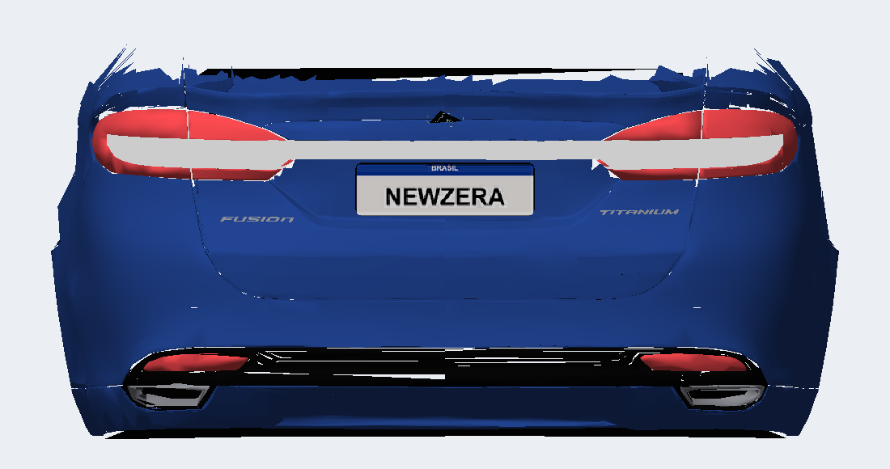
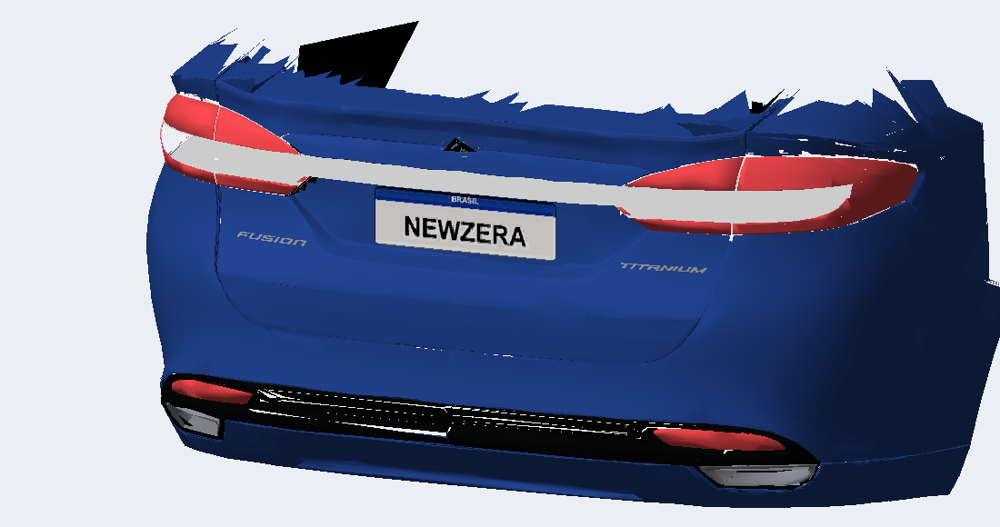

# Friso mais curto e branco uniforme — v10.13

O usuário indicou que a v10.12 ainda invadia a lateral da lanterna da carroceria. A nova referência delimita o friso em rosa e a parte inferior da lente em amarelo; ambas devem receber o mesmo branco opaco.

A continuação externa agora termina antes da curva lateral: |Y| ≤ 0,775, X ≤ −1,970 e Z entre 0,702 e 0,728, com deslocamento de apenas 3 mm para trás. O contorno é recortado nas superfícies existentes, sem os painéis ampliados v10.11. O friso original da tampa mantém sua geometria.

Friso, fundo branco das lentes e inserções inferiores compartilham a célula MISC RGB 255/255/255, alfa 255, material DULLPLASTIC e normal (−1,0,0). As normais servem à aparência uniforme solicitada, preservando posições e orientação das faces. O exportador tinha uma correção genérica de normais que desfazia essa configuração nas bordas voltadas para baixo e para os lados. A exceção agora se limita às superfícies brancas traseiras identificadas pela célula UV, material e região; os demais detalhes continuam com a correção existente.

Validação passou para limites/índices, referências de texturas, opacidade, rodas idênticas ao 2012 e chamadas de peças. Leitura do BIN compilado confirmou UV e normais idênticos em 500 vértices brancos traseiros. As prévias usam as normais exportadas, sem virá-las para a câmera; ainda não reproduzem o shader e a iluminação do jogo.

GEOMETRY SHA-256 `19108A72C292282D3E9E0FFCD6BC8CDE405DAB1064052F40755E6AB33581C2B1`; TEXTURES permanece `92B437E1BE6B57CD9FEBDD4425920BBC70F9649D9D04576BBFAF20C2B896C50B`. A uniformização usa a célula branca já existente e altera os UVs das superfícies, sem precisar mudar o atlas.

Instalado no MUSTANGGT do jogo, com hashes conferidos. Backup em `backup/antes-v10.13/CARS/MUSTANGGT/`; candidato em `local/v10.5/out-lamps-uniform-short/`. Release preservada. Aguarda teste visual do usuário.
