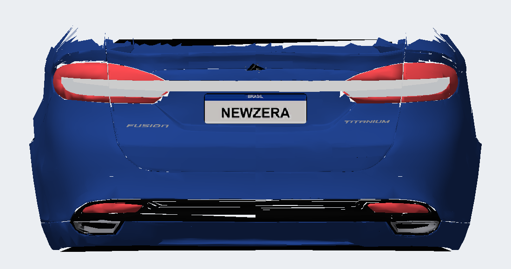
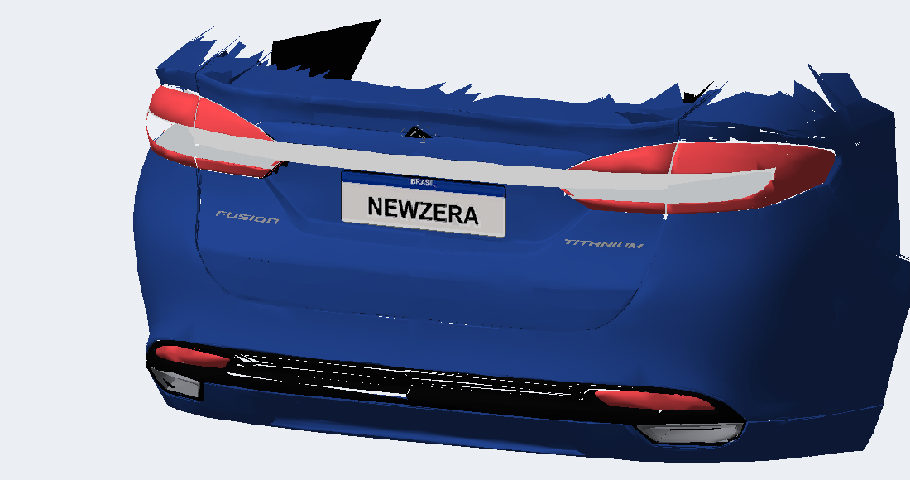

# Dois acabamentos uniformes — v10.14

Correção da interpretação da referência: rosa identifica todo o friso, com acabamento uniforme próprio; amarelo identifica a parte inferior da lente, com branco de lanterna uniforme próprio. As duas regiões não devem ter a mesma cor.

Mantidas todas as posições de vértices e índices da v10.13. O friso original e suas continuações usam a célula branca opaca RGB 255/255/255. Os fundos das lentes e as inserções inferiores usam a célula branca de lente RGB 238/240/242 (após compressão DXT1, a amostra lida é 238/242/246). Ambas têm alfa 255 e normais uniformes; o material DULLPLASTIC visível no jogo foi preservado.

O remapeamento de UV agora mantém as células explícitas do atlas. A regra anterior convertia qualquer U maior que 0,75 para o branco do friso, incluindo a célula de branco de lente. As superfícies das lentes agora mantêm sua própria célula até o BIN compilado.

Validação passou para limites/índices, referências de texturas, opacidade, rodas e chamadas de peças. Comparação com a v10.13 confirmou posições e índices idênticos em todos os sólidos. Leitura do arquivo compilado encontrou 334 vértices traseiros com o branco do friso e 166 com o branco de lente, mantendo normais uniformes. Aparência no jogo ainda exige avaliação do usuário.

GEOMETRY SHA-256 `FFAF33FC8EFA734A0751AEF916B2F660835C38E7E80C71989CBE51461FB4791C`; TEXTURES inalterado `92B437E1BE6B57CD9FEBDD4425920BBC70F9649D9D04576BBFAF20C2B896C50B`. Instalado no MUSTANGGT, com hashes conferidos. Backup em `backup/antes-v10.14/CARS/MUSTANGGT/`; candidato em `local/v10.5/out-lamps-two-finishes/`. Release preservada.

## Resultado no jogo e reversão

Reprovada: o jogo trava e fecha ao visualizar o Fusion 2018. Registro Windows às 21:03:09, 06/10/2026: SPEED2.EXE, 0x80000003, deslocamento 0x0003BD50. O código neste endereço executa INT3, mas o registro não informa a condição que chamou essa interrupção. As pastas WER consultadas não guardavam o dump, mas foi encontrado em `%LOCALAPPDATA%/CrashDumps/SPEED2.EXE.23360.dmp`. MainLog.txt não registra a execução atual.

Comparação confirmou que as únicas alterações entre os BIN v10.13/v10.14 são UVs de 111 vértices da tampa e 55 da BASE. Posições, índices, normais, cores dos vértices, grupos, materiais e atlas não mudaram. Os arquivos são estruturalmente válidos; isso não comprova estabilidade no jogo, nem permite atribuir a causa à cor da lente.

Restaurada a v10.13 do backup, com GEOMETRY `19108A72C292282D3E9E0FFCD6BC8CDE405DAB1064052F40755E6AB33581C2B1` e TEXTURES `92B437E1BE6B57CD9FEBDD4425920BBC70F9649D9D04576BBFAF20C2B896C50B`. Hashes instalados conferidos e validação passou. Arquivos v10.14 preservados em `backup/falha-v10.14/CARS/MUSTANGGT/`; registro Windows em `local/v10.14-crash/windows-event.txt`. Código v10.14 permanece experimental, sem publicação; não reinstalar esta tentativa sem diagnóstico. O usuário ainda deve confirmar a execução após a reversão.

### Dump encontrado em CrashDumps

A pilha do dump atual confirma retorno `0x63A265` após INT3, chamado por `0x63ADAC` e `0x63B25D` na rotina de carregamento. É o mesmo retorno das falhas registradas no orçamento tampa + roda (lição 10 em PORTAR-PARA-NFSU2). O estado do controlador usado nesse ponto tem `[EBX+8] = 0`, que aciona a interrupção; isso não identifica, por si só, se houve pressão de memória, estado inválido ou outra causa. Aparece no dump a identificação `CARS\MUSTANGGT\TEXTURES.BIN: StrmHdrChks`; não interpretar esse rótulo como prova de textura corrompida, pois o atlas é idêntico ao da versão que abriu.

Como diagnóstico independente, preparar variante com pintura da tampa reduzida de 8.000 para 6.000 faces. Lanternas, friso e suas dimensões devem permanecer intactos. Manter a v10.13 restaurada até confirmar o resultado do teste; candidato reduzido não é evidência de correção sem teste no jogo.

O usuário confirmou que a v10.13 restaurada abriu normalmente. Em seguida foi instalada a variante de diagnóstico v10.15, descrita em [FRISO-v10.15.md](FRISO-v10.15.md).
