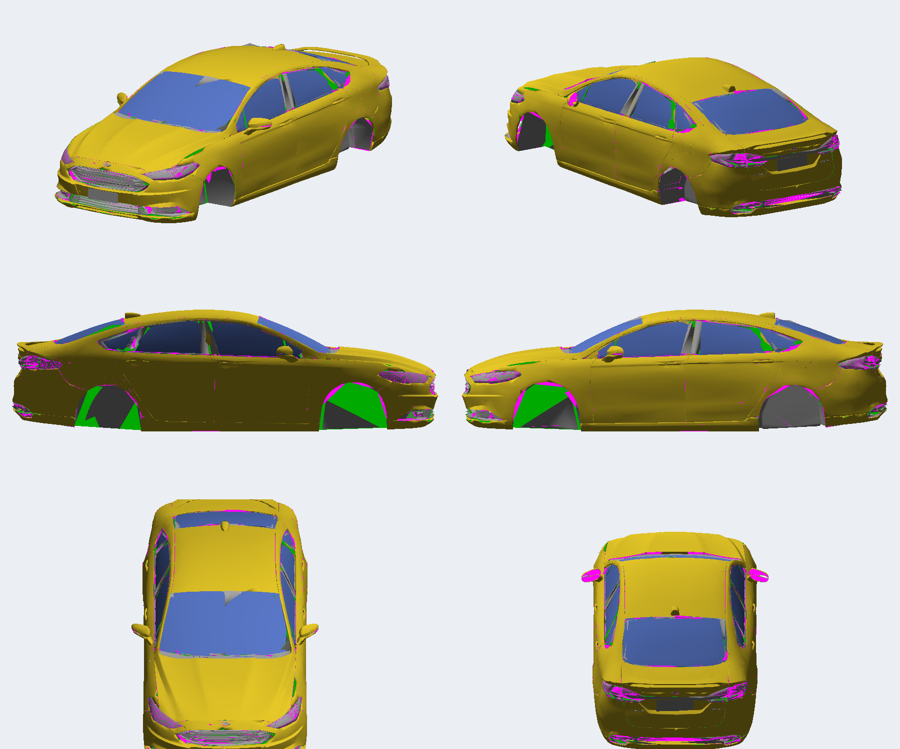

# Portar o Fusion do Most Wanted 2005 para o Underground 2

O método fica neste repositório. O `fusion-mw2005` só fornece o ZIP da release; nada de lá é editado.

| Port | Most Wanted | Underground 2 | Carro |
| --- | --- | --- | --- |
| `2018` | `MUSTANGGT` | `MUSTANGGT` | Fusion Titanium 2018 AWD |
| `2012` | `COBALTSS` | `FOCUS` | Fusion 2012 FWD |

A tabela está em `scripts/ports.py`. Os dois ports usam o mesmo caminho do 2018: corte entre LOD A e LOD B, teto de 21.500 triângulos, vidros de `docs/vidros_v5.npz`, adesivos e UV de vinil. O 2012 só troca a origem (`COBALTSS`), o slot de destino (`FOCUS`) e a tração (dianteira). As luzes do 2012 já vêm nos dois lados do BIN do Most Wanted; o script inclui `LEFT_*` quando essa peça existe. O 2018, que só tem `RIGHT_*`, segue como antes.

O 2018 aprovado está em `CARS/MUSTANGGT`. Ele substitui o Mustang GT do jogo: no Underground 2 esse slot também se chama `MUSTANGGT`, o mesmo nome do Most Wanted. Esse `TEXTURES.BIN` também é o molde (`ports.TEMPLATE`) dos dois ports. O 2012, quando for gerado, ocupa o `FOCUS`.

O diário da v9 está em [TODO.md](../TODO.md). As lições do Most Wanted continuam em `fusion-mw2005/docs/APRENDIZADOS.md`.

## O que cada IA fez

As três entraram em etapas diferentes. Repetir o port é repetir essa divisão, não pedir a uma só que refaça o caminho inteiro.

| Quem | Onde | O que ficou de útil |
| --- | --- | --- |
| **Codex** | Começo do Most Wanted (`fusion-mw2005/docs/historico/demanda-inicial.md`, release v0.1) | Não converter o GTA do zero. Transplantar a malha nova para um **carro doador que já abre no jogo**, preservando slot, marcadores e o formato que o compilador espera. Blender headless gera renders de conferência; a interface fica para o olho humano. |
| **Claude** | Refino do Most Wanted, a partir da V3 (`fusion-mw2005/versions/v3-fusion-ajm3899/STATUS.md`, `fusion-mw2005/docs/APRENDIZADOS.md`) | Um defeito por vez, medido na malha, com render que imita o jogo (face de costas descartada, normais de vértice). A grade “translúcida” era DXT3 em peça opaca. O limite de 65.535 índices, os kits que os carros prontos exigem e a UV de vinil contínua nasceram aqui. |
| **Cursor** | Este repositório | MW só de leitura. A primeira tentativa truncou a malha (cerca de 31 MB, 159 peças, flags `0x4080`, TPK do MW cru) e não se sabe se chegou a desenhar o carro. A que abriu reescreve o `GEOMETRY.BIN` no layout do compilador nfsu360, copia a estrutura de um mod sedã que já funciona e testa no jogo a cada versão. |

O Codex montou o hábito de partir de um doador. O Claude fechou a malha que o Most Wanted aceita. O Cursor traduziu essa malha para este jogo. O próximo port começa no ZIP já aprovado de `fusion-mw2005/release/` e segue os scripts em `scripts/`.

## Regras que não mudam

1. **Não editar** `fusion-mw2005`. A entrada é o ZIP em `release/`: `Fusion2018_AWD_MW2005.zip` (`CARS/MUSTANGGT`) ou `Fusion2012_FWD_MW2005.zip` (`CARS/COBALTSS`).
2. **Não reusar o `GEOMETRY.BIN` do MW.** O Underground 2 fecha ou ignora peças nesse layout. O escritor é o `ug2write.py`, no layout nfsu360.
3. **O slot de destino está na tabela acima.** A v9 mediu o que o slot `FOCUS` desenha (`BODY`, `KITW`, `BASE`, `TRUNK`, `FRONT_WHEEL` e adesivos). O 2012 herda essa lista. O 2018 grava os mesmos nomes com prefixo `MUSTANGGT`. `ROOF` e `DOOR_*` continuam de fora: a v8 ficou sem teto, sem portas e sem capô porque a pintura tinha parado nessas peças.
4. **Descobrir a lista de peças no doador, não no nome.** No Focus do Escort o jogo desenha `BODY` (e `KITW`), `BASE`, `TRUNK`, `FRONT_WHEEL` e os adesivos. `ROOF` e `DOOR_*` são ignorados: a v8 do Fusion apareceu sem teto, sem portas e sem capô porque a pintura tinha sido parar nessas peças.
5. **Uma variável por teste.** Se o jogo fechar na seleção, separar geometria, textura e `GlobalB`. A v1 e a v2 do Fusion fechavam com peças menores e com sólidos em ordem de hash; as duas usavam o mesmo compressor JDLZ. A v3, com a mesma geometria e textura sem compressão (RAWW), abriu.
6. **Não truncar malha** para caber no limite. Cortar triângulos no meio abre buraco. Repartir em peças que o slot desenha, ou usar o LOD autoral mais leve nas áreas planas.
7. **Jogo fechado** para copiar arquivos. Conferir SHA-256 depois. Backup do `GlobalB.lzc` antes do primeiro patch.

## Passo a passo

### 1. Entrada e doador

A pasta de trabalho é este repositório:

- `mw/` = ZIP da release do `fusion-mw2005`, extraído, com `CARS/MUSTANGGT` ou `CARS/COBALTSS`.
- O molde de textura é `CARS/MUSTANGGT/TEXTURES.BIN`. Os dois ports copiam dele o cabeçalho DXT e as texturas `SHADOWFE`, `SHADOWIG` e `NEON`, já com o prefixo do slot de destino. O Escort RS saiu do repositório; o crédito a ele continua no README.

Os outros mods de `source/` saíram depois que o Fusion foi aprovado. O que cada um ensinou já está no diário; o arquivo não entra na reconstrução:

| Mod | O que ficou anotado | Por que saiu |
| --- | --- | --- |
| Ford Focus RS 2018 | Mesmo layout nfsu360 no slot FOCUS. Dois sólidos `FOCUS_BASE_A` no mesmo arquivo; não foi confirmado se o jogo desenha os dois | Não foi o doador. A lista de peças que o slot desenha é a do Escort |
| McLaren Senna (slot LANCEREVO8) | 20.486 triângulos / 61.458 índices abrem o jogo | Supercarro. A física do Lancer vem do registro `LANCEREVO8` no `GlobalB.lzc` do jogo, não deste mod. As rodas medidas nele não entraram |
| Cadillac Escalade (F-150) | Uma peça com 17,7 mil vértices abre | Picape. A posição das rodas não entrou |
| Mustang Shelby GT | Um mod UG2 tem as peças `DECAL_*` que o Escort não tem | Os adesivos saíram das peças do MW e do molde de capô do Corolla. A v9 aprovada já mostra o carro |

```
python extract_mw.py 2018          # mw/CARS/MUSTANGGT -> mw_parts.pkl e texdump/
python build.py out 2018           # out/ com peças MUSTANGGT_*
python globalb_patch.py GlobalB.lzc out/GlobalB.lzc 2018

python extract_mw.py 2012          # mw/CARS/COBALTSS; mesma pipeline
python build.py out 2012           # out/ com peças FOCUS_*
python globalb_patch.py GlobalB.lzc out/GlobalB.lzc 2012
```

`extract_mw.py` e `build.py` sem argumento rodam o port `2018`. O `preview.py` lê o BIN gerado.

`extract_mw.py` lê o BIN do MW (`scripts/mwgeo.py`, `scripts/tpk2.py`). `build.py` grava o BIN do UG2 (`scripts/ug2write.py`, `scripts/tpkwrite.py`). O `preview.py` lê de volta o que foi gravado: se o preview mente, o escritor mente.

Python 3, numpy e Pillow. Decimador, DXT, JDLZ e o extrator 7z estão no próprio `scripts/` porque o ambiente do port não tinha pip.

### 2. Geometria

Orçamento por sólido: **no máximo 21.500 triângulos (64.500 índices)**. Passar de 65.535 índices fecha o Underground 2. No Most Wanted, um sólido de um grupo só ainda aparecia acima desse número; aqui não.

No Fusion o LOD A tem cerca de 190 mil triângulos. O que coube:

| Peça UG2 | O que entrou | Triângulos |
| --- | --- | --- |
| `KIT00_BODY_A` e `KITW01–04` | pintura LOD B nas áreas planas; LOD A no bico, na frente do teto e no para-choque traseiro. As cinco carrocerias são a mesma malha | 21.228 |
| `KIT00_TRUNK_A` | tampa LOD A e a lanterna central | 18.021 |
| `BASE_A` | base, capô (só a face de cima), vidros, faróis, lanternas, interior, motorista | 21.255 |
| `KIT00_FRONT_WHEEL_A` | roda LOD B | 8.614 |
| `DECAL_*` | vagas de adesivo, malhas pequenas | — |

Azul é a carroceria, cinza a base, laranja a tampa, preto a roda. O render lê o `GEOMETRY.BIN` instalado.


Cortes entre LOD A e LOD B são exatos (`scripts/clip.py`): as peças se encontram sem degrau. Decimar o LOD B por QEM deformou o encontro para-lama/porta; o LOD C autoral aguenta área plana, o LOD A fica onde o reflexo acusa faceta.

Os quatro `KITW` existem mesmo quando a malha é igual à de fábrica. Carro da IA aplica kit aleatório; kit ausente some com a carroceria. No Most Wanted isso já era verdade para os presets do `GLOBALB.BUN` (Razor, cutscenes). Aqui a regra é a mesma, com menos nomes de peça.

**Vidros.** O vidro do MW é dupla face e está partido em `FRONT_WINDOW_A` e `REAR_WINDOW_A`. Decimar as duas camadas juntas abre fresta. O que funcionou foi gerar uma lâmina por janela, face única, alargada e dobrada para baixo da moldura (`scripts/newglass.py`, resultado em `docs/vidros_v5.npz`). Textura `WINDOW`, material `WINDSHIELD`.


**Capô.** O capô do MW tem duas faces coincidentes. Ficar só com a de cima. As duas, depois de decimadas, viram mancha preta.

**Normais e faces de costas.** O jogo não desenha o verso. Magenta no render = buraco. Normal do vértice contra a face = mancha escura. Recalcular só o vértice ruim; suavizar a malha toda piora (lição já fechada no Most Wanted). Neste render o para-lama por dentro sai verde.



**Emblema.** Sólido pequeno no bico pode ser removido; o rebaixo que ele deixa é preenchido empurrando os vértices da pintura e regravando as normais.


A pintura que para em `ROOF` e `DOOR_*` some no jogo: o slot FOCUS não desenha essas peças. A v8 ficou sem teto, sem portas e sem capô.


### 3. Texturas

Peça opaca é **DXT1**. DXT3 não grava profundidade: o que for desenhado depois pinta por cima, mesmo estando atrás. Foi a grade do Most Wanted. No Fusion, MISC, LOGO, INTERIOR, BADGING, roda, pneu, motorista e as carcaças de farol e lanterna são DXT1. As lentes são uma cópia DXT3 da mesma folha e ficam por último na ordem de desenho.

O `TEXTURES.BIN` instalado é **RAWW**, no layout do `mwtc`, sem o compressor JDLZ próprio. Esse compressor usa cópias de até 4.098 bytes; o nfsu360 no Escort não passa de 710 e ainda deixa um byte a mais no fim do blob. Com JDLZ o Fusion fechava ao ser selecionado. `scripts/jdlz.py` existe e faz ida e volta contra o descompressor do Escort; não é o que vai para o jogo.

### 4. Adesivos e vinis

São sistemas diferentes.

- **Adesivo** (para-brisa, porta, capô) é uma peça própria: nome `FOCUS_DECAL_…`, UV 0–1, textura global `DUMMY_DECAL1..8` (`910E6654`–`910E665B`), material `DECAL` (`02A05578`). O Corolla e o Mustang do UG2 têm essas peças; o Escort não. Sem elas o adesivo não aparece. O script é `scripts/decals.py`. Capô o MW não tinha: o retângulo veio do Corolla.
- **Vinil** é desenhado em cima da UV da pintura, no molde do `VINYLS.BIN` daquele slot, não na UV do Most Wanted. O molde do Focus está sem compressão em `FOCUS_DEBUG`. `scripts/vinyluv.py` projeta a pintura nesse molde (lateral esquerda em cima, teto no meio, lateral direita embaixo). A escala sai dos círculos das rodas do molde.

Os grupos gravam os limites reais da peça e o cabeçalho grava o raio. As primeiras versões gravavam ±5000; os carros originais não fazem isso.

O `VINYLS.BIN` do slot continua o do carro original. A pintura é que foi entortada para o molde dele.


### 5. Rodas, marcadores e performance

Medir os arcos na malha. No Fusion: dianteira X = +1,431, traseira X = −1,311 (entre-eixos 2,74 m), para-lama em |y| = 0,91. Um port anterior tinha gravado 3,3 m de entre-eixos.

No `GlobalB.lzc`, cada roda é x, y, z, raio e largura. Ordem FL, FR, RR, RL. **+Y é o lado esquerdo** no Underground 2; os marcadores vindos do MW trocam esquerda e direita. Y = ±0,78 entrou. Z, raio e largura ficaram os do Escort (Z ≈ 0,098, raio ≈ 0,308, largura 0,195), que o jogo aprovou. A primeira conta (Z 0,13, raio 0,3225, largura 0,235) não é a que está instalada. O patch não sobrescreve esses três campos do arquivo de entrada.

Marcadores que acompanharam o MW: faróis (2,15; ±0,577; 0,515), lanternas (−2,22; ±0,653; 0,688), escapamentos (−2,32; ±0,635; 0,135), brake light central, aerofólio (−2,15; 0; 0,868), entrada de ar do teto (0,3; 0; 1,207).


Performance não está na malha. No Most Wanted ela mora no `ATTRIBUTES.BIN` / `ATTRIBUTES.MWPS`. No Underground 2 mora no registro `CarTypeInfo` do `GlobalB.lzc`: chunk `0x34600`, 2.192 bytes por carro. `scripts/globalb_patch.py` copia blocos de outros carros do mesmo arquivo e escala o torque. Os dois ports usam o mesmo chassi da v9: motor e câmbio do Corolla com todas as curvas ×2,212 (248 cv, 288 Nm), pneus, suspensão, direção e freios do Lancer, massa 1,63 t, dimensões 4,73 × 1,85 × 1,46 m e inércia recalculada. O 2018 grava isso no registro `MUSTANGGT`, com divisão de torque 0,5 (integral). O 2012 grava no registro `FOCUS`, com divisão 1,0 (dianteira). O entre-eixos do Focus original é 2,54 m e a massa 1,15 t; copiar o registro inteiro do carro de estoque deixa o sedã longo com física de carro curto.

O `GlobalB.lzc` desta cópia está descomprimido (o Nikki salvou assim). O original do jogo é JDLZ. O patch recusa arquivo compactado. Offsets e o que cada faixa de bytes significa estão no fim de [TODO.md](../TODO.md).

Aplicar o patch **em cima do GlobalB atual**, não em cima de uma cópia antiga: o Nikki e outros mods já podem ter mexido no arquivo.

### 6. Provar que abre, depois que parece certo

Ordem que separou as causas no Fusion:

1. Geometria do doador regravada pelo nosso escritor, textura do doador, GlobalB original. Se fechar, o escritor está errado.
2. Trocar uma peça por vez (`scripts/hybrids.py`): base, carroceria, roda. No Fusion os híbridos foram gerados e não precisaram ser usados, porque o fechamento era a textura.
3. Textura RAWW com GlobalB original. Foi o que fez a v3 abrir.
4. Só então rodas (X/Y), vidros, capô, lanternas, adesivos, LOD e o GlobalB de performance.

Quando fechar, não mudar geometria e GlobalB no mesmo teste.

Render de bancada: fundo magenta, face de costas descartada, normal de vértice. O render de duas faces esconde buraco; o render com normal da face esconde mancha. Captura do jogo manda mais que o render. Guardar em `docs/in-game-vN/`.

### 7. Instalar

`release/instalar.bat` segue o `fusion-mw2005/release/instalar.bat`: procura o jogo, pede confirmação, copia `CARS/<SLOT>`. No Underground 2 o executável é `SPEED2.EXE` e, além da cópia, o bat aplica o mesmo patch de `globalb_patch.py` no `GLOBAL/GlobalB.lzc`. Na primeira vez o arquivo anterior vira `GlobalB.lzc.antes-fusion`.

O ZIP da release leva o bat ao lado de `CARS/`, não a árvore inteira do repositório.

## O que não copiar do Most Wanted

| No MW | No UG2 |
| --- | --- |
| Sólido de um grupo pode passar de 65.535 índices e ainda aparecer | Qualquer peça acima de 65.535 índices fecha o jogo na seleção |
| Duas pastas, `CARS` e `ADDONS/CARS_REPLACE` | Só `CARS/<SLOT>`. O Mod Loader não entra |
| Performance no VLT / `ATTRIBUTES.MWPS` | Performance no `GlobalB.lzc` |
| DXT3 caseiro nas folhas opacas foi a causa da grade | A mesma regra, e ainda o JDLZ caseiro fecha o jogo. Gravar RAWW |
| Kits `KIT00`–`KIT05` e `BODY_A`–`E` porque o `GLOBALB.BUN` chama esses nomes | Só as peças que **aquele slot** desenha. Medir no mod doador, não na lista do MW |
| UV de vinil `u = 0,169·x + 0,5` | UV projetada no molde do `VINYLS.BIN` do slot |
| Esquerda/direita do marcador como no MW | +Y é esquerda; trocar os lados ao copiar o marcador |

## Checklist do próximo carro

1. ZIP aprovado em `fusion-mw2005/release/`, o da tabela (`2018` ou `2012`). Nenhum arquivo de lá é editado.
2. Rodar o `2018` antes do `2012`. O segundo reaproveita corte, vidro, adesivo, vinil e o molde `CARS/MUSTANGGT/TEXTURES.BIN`.
3. `ug2write.py` regrava o doador e o arquivo volta igual chunk a chunk.
4. Cada sólido novo ≤ 21.500 triângulos. Kits da IA preenchidos. Teto, portas e capô dentro das peças que o slot desenha.
5. Opacos em DXT1. Lentes em DXT3, por último. `TEXTURES.BIN` em RAWW.
6. Vidro de face única, por baixo da moldura. Capô só com a face de fora. Sem decimação QEM na lataria.
7. Peças `DECAL_*` com material e textura globais do jogo. Pintura com UV no molde de vinil do slot.
8. Rodas medidas na malha (X/Y). Z, raio e largura só mudam depois de ver o carro no jogo.
9. `GlobalB` patchado por cópia de blocos de carros do mesmo arquivo, sobre o arquivo atual, com backup. Se estiver JDLZ, salvar descompactado no Nikki antes.
10. Teste no jogo: seleção, garagem, cidade, largada. SHA-256 no README. Uma versão por commit.

## Onde está o detalhe

| Assunto | Arquivo |
| --- | --- |
| Diário v1–v9, formatos, offsets do GlobalB | [TODO.md](../TODO.md) |
| O que foi instalado e as capturas finais | [README.md](../README.md) |
| Lições da malha no Most Wanted | `fusion-mw2005/docs/APRENDIZADOS.md` |
| Por que a grade sumia (DXT3) | `fusion-mw2005/versions/v3-fusion-ajm3899/reference/APRENDIZADO_GRADE_FRONTAL.md` |
| Plano original do Codex | `fusion-mw2005/docs/historico/demanda-inicial.md` |
| Scripts do port | `scripts/` (`build.py`, `ug2write.py`, `globalb_patch.py`, `clip.py`, `newglass.py`, `decals.py`, `vinyluv.py`) |
| Instalador | `release/instalar.bat` |
