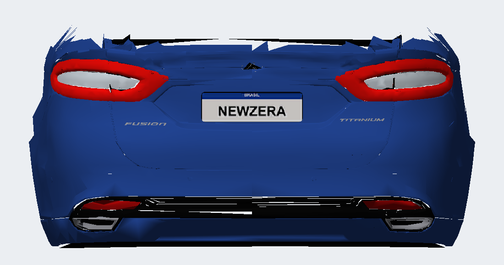
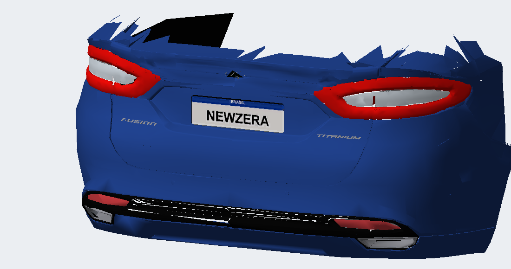

# Refletores inferiores do 2012 — vermelho opaco

Aplicado o aprendizado do reparo do 2018 aos dois refletores inferiores do 2012, acima dos escapes. A reconstrução inicial, a partir do ZIP MW v2.7, ficou idêntica aos BIN do 2012 publicados na v1.3; isso permitiu comparar a correção com uma base exata.

Na origem, ambos os refletores estão no mesmo grupo: `COBALTSS_KIT00_RIGHT_BRAKELIGHT_GLASS_D`, material `BRAKELIGHT`, textura `COBALTSS_KIT00_HEADLIGH`. Apesar do nome RIGHT, esse grupo contém os dois lados, com 20 triângulos ao todo. As lentes principais são outros grupos e não receberam este reparo.

Os refletores agora usam `FOCUS_MISC + DULLPLASTIC`, a combinação opaca usada no reparo do 2018. UVs apontam para a célula (13,14) da grade 16×16, pintada em RGB 255/78/86 e alfa 255 depois do redimensionamento. A leitura DXT1 confirmou RGBA 255/76/82/255. A célula não é tocada pelas malhas MISC da origem, incluindo os outros LODs. As faces foram orientadas para fora e a remoção de cópias internas opostas permanece ativa.

Verificação do BIN: os dois refletores têm os mesmos 20 triângulos e a mesma superfície geométrica. Orientar as faces dividiu 15 vértices nas bordas de normais; o TRUNK passa de 19.241 para 19.256 vértices e mantém 20.158 triângulos. O grupo MISC acrescentado é único por textura/material; TRUNK passa de três para quatro grupos. Todos os limites, índices e referências de textura foram conferidos. Os outros sólidos (inclusive rodas) são idênticos, assim como todas as texturas fora da célula vermelha MISC. O 2018 permanece instalado na versão aprovada.

GEOMETRY SHA-256 `6900E72FEA7B43D15F35749114A5969579F7770307DEF6218CEFCCF5C05CC3EC`; TEXTURES `1398FB107A57B4A45397FEF0B19060AC3FB553A610BA754862BF94B4066557C2`. Instalado com jogo fechado no slot FOCUS, com hashes conferidos. Backup em `backup/antes-refletores-2012/CARS/FOCUS/`; construção e verificação em `local/reflectors-2012/`. Reconstrução: executar `python ../../scripts/build.py out-opaque-reflectors 2012` nessa pasta após extrair a origem com `extract_mw.py 2012`.

Os BIN versionados e a release v1.3 continuam no estado anterior até a avaliação deste candidato. Aparência e estabilidade no jogo aguardam confirmação do usuário. Este teste corrige somente os refletores inferiores; não representa aprovação das demais luzes do 2012.
