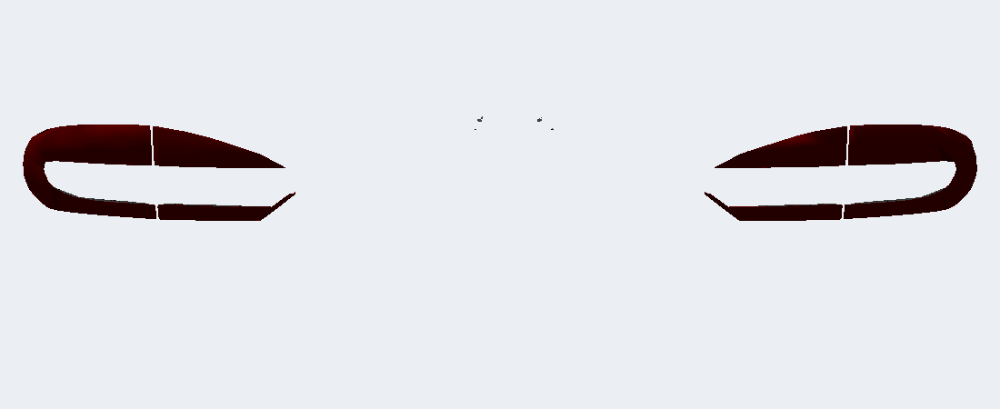
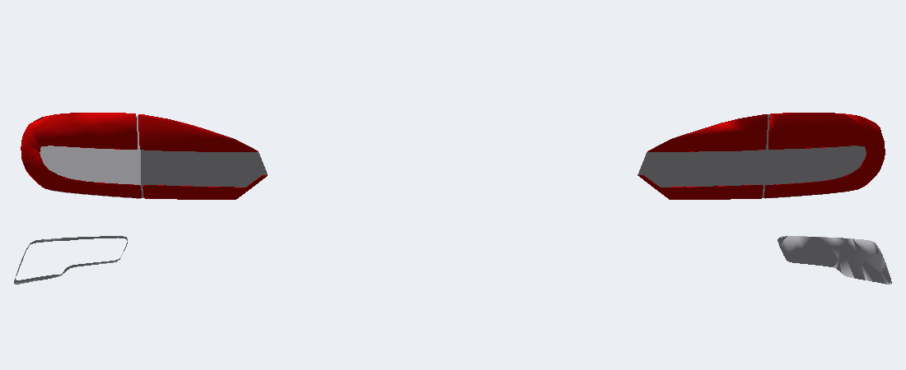
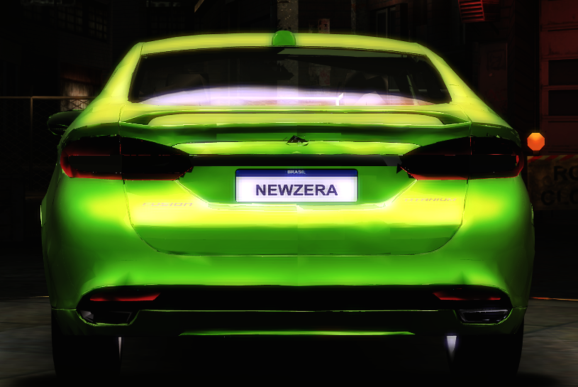
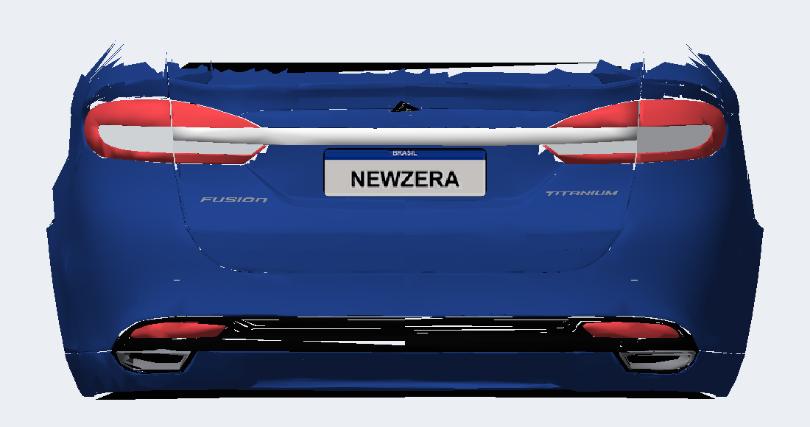
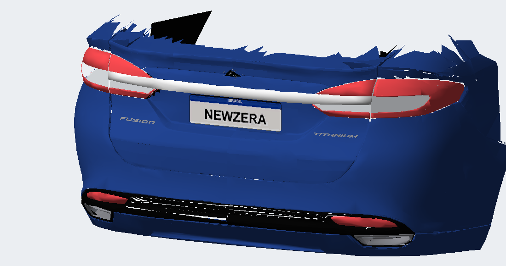
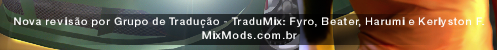

# Reparo das lanternas do Fusion 2018 — v10.9

Registro de 06/10/2026. O usuário confirmou que v10.7/v10.8 exibiram as lanternas e refletores, mas com cor escura; o friso também estava escuro. A v10.9 foi instalada e aprovada pelo usuário: “perfeito”. Os BIN e o log foram consolidados no repositório.

## Origem e construção

O Fusion 2018 do MW tem friso. A remoção documentada no Fusion 2012 não pode ser atribuída ao 2018. Na fonte `MUSTANGGT_BASE_A`, grupo `MUSTANGGT_MISC`, o friso é uma ilha de 100 triângulos: X −2,304…−2,215; Y −0,585…+0,585; Z 0,685…0,729. A seleção em `solid_lamps.trunk_trim_mask` usa esses limites geométricos, sem depender do número da ilha no LOD.

| Origem usada na construção | Contornos e fundos opacos construídos |
| --- | --- |
|  |  |

Estas duas imagens são diagnósticos da construção anterior, não resultados aprovados no jogo.

## Evidência e correção atual



Na v10.8, a cor RGB mais clara não resolveu o escurecimento. O friso original em BASE ainda usava a textura antiga e podia encobrir a faixa sobreposta. A v10.9 elimina a faixa criada sobre a pintura, recupera o friso original em TRUNK e o remapeia para branco RGB 255/255/255 em MISC. As lentes e refletores mantêm vermelho RGB 255/78/86, alpha 255 e DXT1, com remoção das faces opostas coincidentes. Os fundos das lentes também passam a ter uma única face orientada para fora.

| v10.8 compilada | v10.9 compilada, friso original |
| --- | --- |
|  |  |



O renderer anterior invertia normais voltadas para longe da câmera, podendo ocultar problemas de iluminação. Estas novas prévias leem GEOMETRY/TEXTURES e respeitam as normais e o descarte de faces. O resultado visual da v10.9 no UG2 foi aprovado pelo usuário; a prévia continua sem reproduzir seu shader. Não foi usada a textura das rodas no friso.

## Copyright da tela inicial



A restauração de NA_ENGLISH.TXT não atingiu esta mensagem. A entrada `181419E5` de English.bin contém o crédito exibido nesta captura; no backup original, contém “© 2004 Electronic Arts Inc. All rights reserved.”. Foi restaurado o equivalente em português: **© 2004 Electronic Arts Inc. Todos os direitos reservados.** A grafia oficial é Electronic. Somente os bytes dessa string e seu espaço restante foram substituídos; tamanho do arquivo, tabela de offsets, demais entradas e chunks continuam iguais.

## Construir e gerar as prévias

Na pasta `local/v10.5`, com os dados extraídos do MW e as dependências Python do projeto:

```powershell
python ../../scripts/build.py out-lamps-white-single 2018
```

Na raiz do repositório:

```powershell
python scripts/preview_tail.py local/v10.5/out-lamps-white-single/GEOMETRY.BIN local/v10.5/out-lamps-white-single/TEXTURES.BIN docs/in-game-v10.9/previa-v10.9
python scripts/restore_startup_copyright.py CAMINHO/English.bin CAMINHO/English.copyright.bin
```

O script do idioma produz uma cópia; não altera automaticamente a instalação. Os arquivos v10.9 desta sessão foram instalados manualmente com backup em `backup/antes-v10.9/`.

## Validação e arquivos instalados

Validação de limites, índices, referências de textura, opacidade, roda idêntica à do Focus e chamadas BODY/TRUNK/WHEEL passou. Conferência binária do idioma confirmou que todos os bytes fora da string de copyright ficaram iguais. A instalação foi reaplicada após o usuário fechar o jogo; hashes instalados idênticos ao candidato. Iniciar novamente para carregar os arquivos novos.

| Arquivo | SHA-256 |
| --- | --- |
| GEOMETRY.BIN | `C1BB98C69F47D35DD57A23FF5A84271B8730905A1EE96EC99518FFE965CC6B5C` |
| TEXTURES.BIN | `92B437E1BE6B57CD9FEBDD4425920BBC70F9649D9D04576BBFAF20C2B896C50B` |
| English.bin | `3F54514EE3527B87D24855E3B9DEDBC3060B214C5158CC4AAC05F3F5C8142CAA` |

Conjunto BODY/BASE/TRUNK/WHEEL: 62.920 vértices e 59.868 triângulos. Resultado visual aprovado pelo usuário. A abertura da tampa no jogo ainda não foi relatada especificamente.
